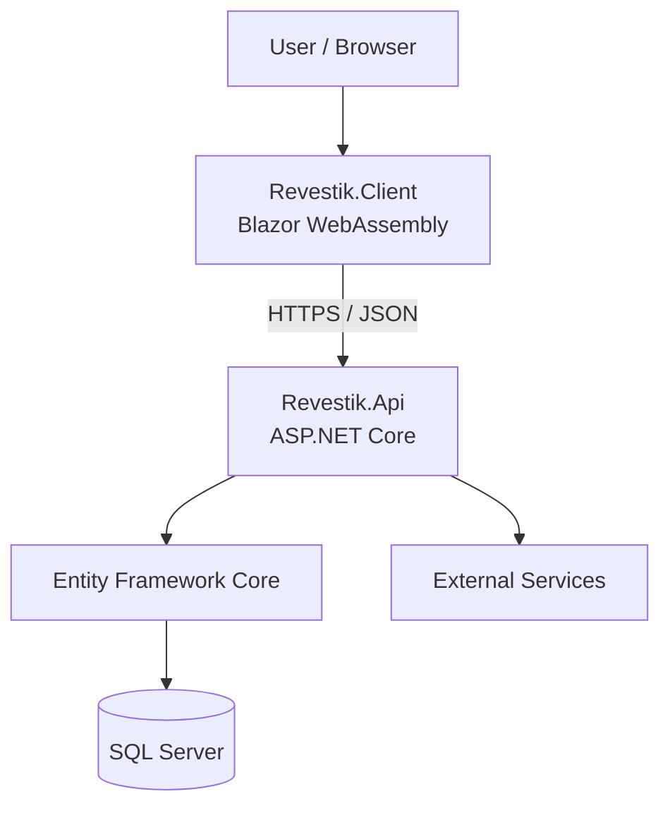
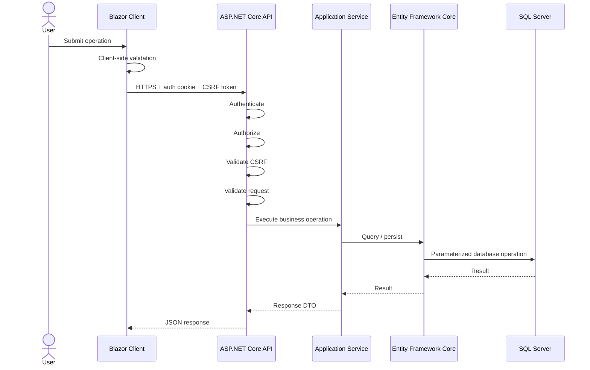

# Revestik

Revestik is a full-stack business management application built with the Microsoft .NET ecosystem.

It is designed to centralize operational workflows such as customer management, inventory, quotations, purchases, accounts receivable, invoicing, and business analytics within a secure and maintainable web application.

The project originated from real small-business operational requirements and is being developed incrementally, with an emphasis on business rules, data integrity, security, testing, and maintainable architecture.

> **Project status:** Project status: Active development. The application foundation and Customer domain are implemented and hardened. The Quotations backend is implemented and verified, while its Blazor workflow and document generation remain in development. Additional business domains are planned.

---

## Technology Stack

### Backend

* .NET 10
* C#
* ASP.NET Core
* Minimal APIs
* ASP.NET Core Identity
* Google external authentication
* Entity Framework Core
* SQL Server
* LINQ
* OpenAPI

### Frontend

* Blazor WebAssembly
* HTML
* CSS
* JavaScript interoperability where required

### Engineering

* xUnit
* Testcontainers
* Git
* GitHub
* GitHub Actions
* EF Core migrations
* CI build/test/publish verification
* SQL Server integration testing


---

## Architecture

Revestik is organized into three primary application projects:

```text
src/
├── Revestik.Client
├── Revestik.Api
└── Revestik.Shared

tests/
└── Revestik.Api.Tests
```

* **Revestik.Client** — Blazor WebAssembly frontend.
* **Revestik.Api** — ASP.NET Core API, business services, authentication, authorization, integrations, persistence, and production host.
* **Revestik.Shared** — request and response contracts shared between client and API.
* **Revestik.Api.Tests** — automated server, security, and hosting tests.



For the detailed architecture:

[Architecture Overview](docs/architecture/architecture-overview.md)

---

## Implemented Capabilities

### Authentication and Security

* ASP.NET Core Identity
* Google external authentication
* Secure cookie-based sessions
* Protected-by-default API authorization
* Role and policy-based authorization
* Antiforgery protection for mutable authenticated operations
* Server-side validation
* Development CORS restrictions
* Secure server-side secret boundary

### Customer Management

### Quotation Management

The Quotations backend is implemented; the Blazor workflow and document generation remain in development.

Current server-side capabilities include:

* Create quotations
* Retrieve quotations by identifier
* Update quotations
* Existing active-customer association
* Registered or manual quotation lines
* Required CABYS codes
* Decimal quantities
* CRC and USD currencies
* IVA-inclusive pricing
* 0% and 13% IVA calculations
* Percentage and fixed discounts
* Additional charges
* Server-authoritative monetary calculations
* Backend-generated `COT-000001`-style consecutive numbers
* SQL Server sequence-backed number generation
* Preservation of quotation identity during updates
* Role and policy-based authorization
* Antiforgery protection for mutable operations
* Server-side persistence and validation
* SQL Server-backed integration testing
* Concurrent consecutive-number verification

Creating or modifying a quotation does not reserve or deduct inventory.

Remaining quotation work includes the Blazor workflow, product-assisted entry, client-side calculation feedback, and commercial PDF/document generation.


### External Integrations

* Costa Rican taxpayer lookup integration
* Location catalog integration
* In-memory caching for location data

### Engineering Foundation

* Automated request-validation tests
* Customer-service and pagination tests
* Quotation calculation and service tests
* Quotation authorization tests
* Quotation API integration tests
* SQL Server Testcontainers integration tests
* Concurrent quotation-number tests
* CSRF tests
* Hosting integration tests
* CI on pull requests and `main`
* Release build verification
* Hosted Blazor publish verification
* Static asset verification
* Brotli asset verification
* Database health endpoint


---

## Request Flow

A typical state-changing request follows this path:



The browser is not treated as a trusted security boundary. Business-critical validation and authorization are enforced by the server.

---

## Business Rules

Important business behavior is documented explicitly instead of existing only implicitly in source code.

Current examples include:

* Customer identification must be unique.
* Identification format depends on identification type.
* Customer contact and location information is required.
* Customer deletion currently behaves as deactivation rather than physical removal.
* Customer listing is paginated and deterministically ordered.
* Quotations belong to existing active customers.
* Quotation lines require CABYS.
* Quotation prices are treated as IVA-inclusive when the applicable rate is 13%.
* Quotations support percentage and fixed discounts.
* Quotation monetary calculations are authoritative on the server.
* Quotation consecutive numbers are generated by the backend through SQL Server.
* Quotation creation does not modify inventory.


See:

[Business Rules](docs/product/business-rules.md)

---

## Testing

Revestik uses focused tests, HTTP integration tests, SQL Server integration tests, security tests, and hosting verification to protect important application behavior.

Current automated coverage includes:

* Customer request validation
* Customer pagination contracts
* Customer service behavior
* Quotation request and nested validation
* Quotation monetary calculations
* Quotation service behavior
* Quotation authorization
* Quotation API contracts
* Quotation SQL Server persistence
* SQL Server sequence-based consecutive generation
* Concurrent quotation-number generation
* CSRF behavior
* Protected mutable endpoints
* Development hosting
* Production hosting
* SPA/API fallback behavior
* Published static asset verification

SQL Server-specific behavior is tested against an isolated SQL Server instance using Testcontainers rather than relying exclusively on mocked or in-memory persistence.

> **Current automated test baseline:** 161 passing tests, 0 failed, 0 skipped.

Run the complete suite:

```powershell
dotnet test Revestik.sln
```

Detailed testing strategy:

[Testing Strategy](docs/development/testing.md)

---


## Continuous Integration

GitHub Actions currently performs:

```text
Restore
   ↓
Release Build
   ↓
Automated Tests
   ↓
Publish
   ↓
Hosted Blazor Asset Verification
```

CI runs on pull requests targeting `main`, pushes to `main`, and manual workflow execution.

The current workflow provides continuous integration, not automated production deployment.

---

## Local Development

### Requirements

* .NET 10 SDK
* SQL Server / SQL Server Express
* Git
* Google OAuth development credentials for authentication

Restore dependencies and repository tools:

```powershell
dotnet tool restore
dotnet restore Revestik.sln
```

Apply database migrations:

```powershell
dotnet tool run dotnet-ef database update `
    --project src/Revestik.Api/Revestik.Api.csproj `
    --startup-project src/Revestik.Api/Revestik.Api.csproj
```

Run the API:

```powershell
dotnet run `
    --project src/Revestik.Api/Revestik.Api.csproj `
    --launch-profile https
```

Run the Blazor client in a second terminal:

```powershell
dotnet run `
    --project src/Revestik.Client/Revestik.Client.csproj `
    --launch-profile https
```

Current development addresses:

```text
API:    https://localhost:7126
Client: https://localhost:7081
```

Complete setup instructions:

[Local Development Setup](docs/development/local-setup.md)

---

## Database

Revestik uses SQL Server with Entity Framework Core Code First.

The persistence layer uses:

* EF Core migrations
* Entity configurations
* Required-field constraints
* Maximum lengths
* Check constraints
* Unique indexes
* ASP.NET Core Identity persistence

Important business invariants are protected at more than one level where appropriate:

```text
Client validation
        ↓
Server validation
        ↓
Business logic
        ↓
EF Core configuration
        ↓
SQL Server constraints
```

---

## Deployment

Revestik currently produces a deployable hosted ASP.NET Core + Blazor WebAssembly artifact.

The application is publishable, but a final production hosting platform has not yet been selected and documented.

Current deployment foundations include:

* Release publishing
* Hosted Blazor WebAssembly
* Static asset fingerprinting
* Brotli-compressed assets
* Environment configuration
* Health checks
* Server-side secret boundary

Production infrastructure decisions such as hosting, database infrastructure, secret management, monitoring, backups, and automated deployment remain part of future production work.

See:

[Deployment Guide](docs/deployment/deployment.md)

---

## Product Roadmap

Revestik is being developed incrementally, completing business workflows vertically rather than opening many partially implemented modules.

### Current Focus

**Quotations — In Progress**

The backend foundation is implemented and verified.

Remaining work includes:

* Blazor quotation listing and creation workflow
* Customer-selection experience
* Quotation-line editing
* Product-assisted entry
* Additional-charge editing
* Immediate client-side calculation feedback
* Quotation editing workflow
* Commercial PDF/document generation
* Final end-to-end verification

### Planned Domains

Later product areas include:

* Suppliers
* Inventory
* Purchases
* Accounts receivable
* Sales and invoicing
* Broader CABYS support
* Dashboard and analytics
* Electronic invoicing
* Administrative configuration

These areas should not be considered implemented merely because they appear in the roadmap.

See:

[Product Roadmap](docs/product/roadmap.md)

---


## Documentation

### Product

* [Product Overview](docs/product/product-overview.md)
* [Business Rules](docs/product/business-rules.md)
* [Product Roadmap](docs/product/roadmap.md)

### Architecture

* [Architecture Overview](docs/architecture/architecture-overview.md)

Architecture Decision Records:

* [ADR-001 — Client / API / Shared Architecture](docs/architecture/decisions/ADR-001-client-api-shared-architecture.md)
* [ADR-002 — Cookie-Based Authentication](docs/architecture/decisions/ADR-002-cookie-based-authentication.md)
* [ADR-003 — EF Core and SQL Server](docs/architecture/decisions/ADR-003-ef-core-sql-server.md)

### Security

* [Security Overview](docs/security/security-overview.md)

### Development

* [Local Development Setup](docs/development/local-setup.md)
* [Testing Strategy](docs/development/testing.md)

### Deployment

* [Deployment Guide](docs/deployment/deployment.md)

---

## Legacy Application

The original Revestik prototype was built with HTML, CSS, and JavaScript and used browser-based local storage.

It remains under:

```text
legacy/vanilla-js/
```

and is preserved through the Git tag:

```text
v0.1.0-legacy
```

The legacy application documents the evolution of Revestik from a browser-only prototype into a full-stack .NET application.

---

## Development Principles

Revestik follows several engineering principles:

* Business rules are enforced by the server.
* The client is not considered a trusted security boundary.
* Persistence entities are not exposed as HTTP contracts.
* Critical data integrity is protected at multiple levels.
* Architecture should remain proportional to actual complexity.
* New technologies should solve real requirements.
* Important behavior should receive automated regression coverage.
* Documentation should describe the implemented system rather than aspirational architecture.
* Features should be completed vertically rather than creating many partially implemented modules.

---

## Current Direction

The current development sequence is:

```text
Engineering foundation
        ↓
Customer domain
        ↓
Quotation backend
        ↓
Quotation Blazor workflow
        ↓
Commercial document generation
        ↓
Sales / invoicing workflows
        ↓
Inventory and financial integration
        ↓
Electronic invoicing integration
        ↓
Production hardening
```

The immediate objective is to complete Quotations vertically before expanding into additional transactional domains.

The project favors extracting shared abstractions only when concrete requirements demonstrate that reuse is appropriate, rather than prematurely redesigning Quotations into a generic Sales model.

The goal is to evolve Revestik into a reliable business-management platform while keeping architecture, security, testing, and product requirements aligned.
