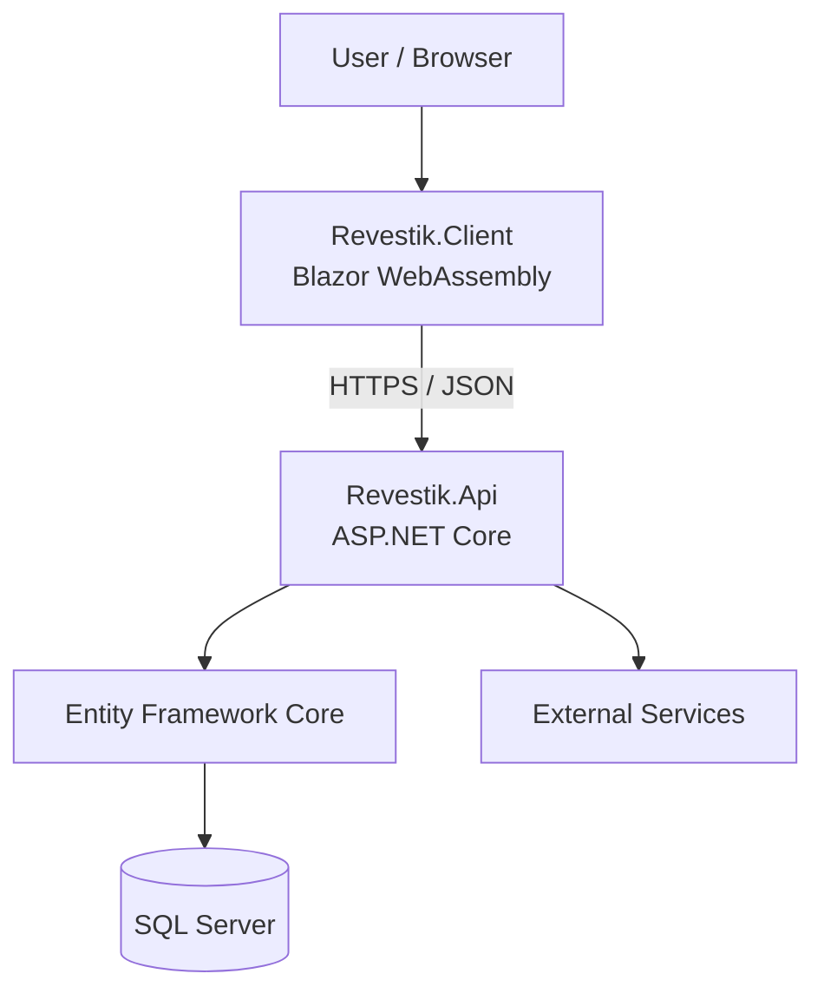
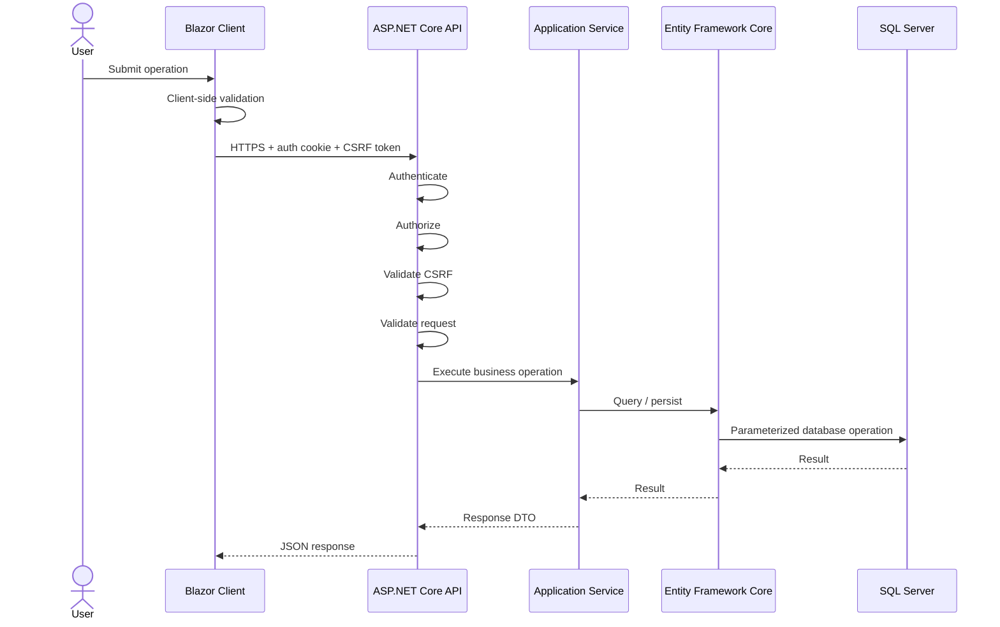

# Revestik

Revestik is a full-stack business management application built with the Microsoft .NET ecosystem.

It is designed to centralize operational workflows such as customer management, quotations, sales, inventory, suppliers, purchases, accounts payable, received electronic documents, expenses, reporting, and business analytics within a secure and maintainable web application.

The project originates from real small-business operational requirements and is developed incrementally, with an emphasis on business rules, data integrity, security, testing, and maintainable architecture.

> **Project status:** Active development. Customer Management, Quotations, Sales, Inventory, Suppliers, Purchases, Accounts Payable, Electronic Documents, CAByS integration, accounting classification, and manual Gmail document ingestion are implemented and verified. The current focus is refining the received-document workflow.

---

## Technology Stack

### Backend

* .NET 10
* C#
* ASP.NET Core
* Minimal APIs
* ASP.NET Core Identity
* Google external authentication
* Entity Framework Core
* SQL Server
* LINQ
* OpenAPI
* QuestPDF
* OAuth 2.0
* XML/XSD processing

### Frontend

* Blazor WebAssembly
* HTML
* CSS
* JavaScript interoperability where required

### Engineering

* xUnit
* Testcontainers
* Git
* GitHub
* GitHub Actions
* EF Core migrations
* CI build/test/publish verification
* SQL Server integration testing

---

## Architecture

Revestik is organized into three primary application projects:

```text
src/
├── Revestik.Client
├── Revestik.Api
└── Revestik.Shared

tests/
└── Revestik.Api.Tests
```

* **Revestik.Client** — Blazor WebAssembly frontend.
* **Revestik.Api** — ASP.NET Core API, business services, authentication, authorization, integrations, persistence, PDF generation, XML processing, and production host.
* **Revestik.Shared** — request and response contracts shared between client and API.
* **Revestik.Api.Tests** — automated server, security, persistence, integration, and hosting tests.


```mermaid
flowchart TB
    Browser[User / Browser]
    Client[Revestik.Client<br/>Blazor WebAssembly]
    API[Revestik.Api<br/>ASP.NET Core]
    EF[Entity Framework Core]
    DB[(SQL Server)]
    External[External Services]

    Browser --> Client
    Client -->|HTTPS / JSON| API
    API --> EF
    EF --> DB
    API --> External
```

Revestik follows a pragmatic modular-monolith architecture. Business domains remain separated by responsibility without introducing microservices, CQRS, event buses, generic repositories, or additional abstraction layers without a concrete need.

For the detailed architecture:

[Architecture Overview](docs/architecture/architecture-overview.md)

---

## Implemented Capabilities

### Authentication and Security

* ASP.NET Core Identity
* Google external authentication
* Secure cookie-based sessions
* Role and policy-based authorization
* Antiforgery protection for authenticated mutations
* Server-side validation
* Development CORS restrictions
* Sensitive credentials kept outside source control
* ASP.NET Core Data Protection for persisted integration state
* Secure XML parsing with external resource resolution disabled

### Customer Management

* Create, retrieve, edit, deactivate, and reactivate customers
* Costa Rican identification validation
* Unique customer identification enforcement
* Contact and structured location information
* Pagination, filtering, search, and deterministic ordering
* Server-side validation and database integrity protections

### Quotation Management

* Create and edit quotations
* `Draft` and `Issued` states
* Existing active-customer association
* Customer snapshot on issue/reissue
* Product-assisted and manual lines
* Optional CAByS
* CRC and USD
* IVA-inclusive calculations
* Discounts and additional charges
* Backend-generated `COT-000001`-style numbering
* QuestPDF generation
* History, search, filters, pagination, and detail view
* Conversion of issued quotations into linked Sale drafts

Creating, editing, issuing, or reissuing a quotation does not reserve or deduct inventory.

### Sales Management

* Direct sales and quotation-to-sale conversion
* `Draft`, `Issued`, and `Voided` states
* Backend-generated `VEN-000001`-style numbering
* CRC and USD
* Product-assisted and manual lines
* Discounts, charges, and IVA-inclusive calculations
* Customer snapshot on issue
* History, search, filters, summaries, and detail view
* QuestPDF generation
* Partial and full payments
* Payment voiding
* Outstanding-balance tracking
* Sale voiding and replacement/correction workflow
* Inventory consumption for product-linked issued sales
* Exact FIFO inventory restoration when a sale is voided

Sales are internal commercial documents. Direct Costa Rican electronic invoicing remains outside the current Sales scope.

### Inventory Management

The Inventory domain is the source of truth for physical stock.

Current capabilities include:

* Configurable product categories
* Product catalog
* CAByS support
* Physical and commercial units
* Unit-conversion rules
* Current stock
* Initial stock
* Immutable inventory movements
* Manual adjustments
* FIFO consumption
* FIFO cost layers
* Unknown historical cost tracking and resolution
* Sale-linked consumption
* Prevention of negative inventory
* Exact sale inventory reversal
* Physical inventory counts
* Traceable physical-count adjustments
* Product deactivation/reactivation and logical archival
* Purchase-linked stock receipt
* Purchase-cost propagation into inventory cost layers
* Concurrency and data-integrity safeguards

Services and commercial charges are not inventory items.

Purchases feed Inventory through explicit stock-receipt operations rather than embedding the Purchase domain inside Inventory.

### Supplier Management

* Create and edit suppliers
* Deactivate and reactivate suppliers
* Search and paginated listing
* Contact information
* Unique supplier-name enforcement
* Supplier purchase history
* Authorization and backend validation

Supplier names are unique. Product names are not used as a global inventory identity constraint.

### Purchases and Accounts Payable

Purchases are implemented as a separate operational domain.

Current capabilities include:

* Manual purchase registration
* Existing supplier association
* Product-linked purchase lines
* Authorized product creation during purchase
* CRC and USD
* Exchange rates
* Discounts, taxes, and totals
* Cash and credit purchases
* Credit terms and due dates
* Purchase payments
* Accounts-payable summaries
* Upcoming and overdue alerts
* Supplier purchase history
* Inventory receipt from purchase lines
* FIFO inventory cost capture
* Prevention of duplicate inventory application
* Transactional consistency for critical purchase operations

A Purchase is an operational business record and is intentionally separate from a received Electronic Document.

### Electronic Documents

Revestik includes a received-electronic-document workflow for Costa Rican fiscal XML.

Current capabilities include:

* Manual XML import
* Original XML preservation
* Document, line, tax, and discount persistence
* Hacienda response association
* Duplicate detection
* Issuer, receiver, currency, totals, and economic-activity data
* Accounting classification
* Operational destination
* Payment-condition classification
* Document-level and line-level classification
* Search, history, and review workflows
* Secure staging/quarantine before canonical acceptance

Electronic Documents do not automatically create Purchases or modify Inventory.

The economic date of a received document is its `FechaEmision`.

### Hacienda XML 4.4

Revestik uses a common Hacienda XML 4.4 platform based on document root/namespace detection and local XSD validation.

Recognized document families include:

* Factura Electrónica
* Mensaje Hacienda
* Mensaje Receptor
* Nota de Crédito Electrónica
* Nota de Débito Electrónica
* Factura Electrónica de Compra
* Factura Electrónica de Exportación
* Recibo Electrónico de Pago
* Tiquete Electrónico

Recognition and processing support are separate concepts. A recognized document whose business processing is not yet implemented remains a valid recognized document instead of being reported as invalid XML.

XML validation uses local schemas, prohibits DTD processing, disables external resolution, and does not download schemas at runtime.

### CAByS and Accounting Classification

Revestik includes a local versioned CAByS 2025 catalog with approximately 20,500 codes.

Current capabilities include:

* CAByS code and description search
* Accent-insensitive search
* Hierarchical category information
* Tax references
* Includes/excludes metadata
* Product lookup support
* Received-document classification support
* Configurable accounting categories
* Document and line classification
* Learned classification rules
* Confidence-based suggestions
* Accounting and payment-condition summaries

CAByS, accounting nature, operational destination, and payment condition are separate concepts.

Automated suggestions remain reviewable and editable.

### Gmail Integration

Revestik can connect to the business Google Workspace mailbox used for received fiscal documents.

Current capabilities include:

* Server-side OAuth 2.0
* `gmail.readonly` scope
* Connect/disconnect/status endpoints
* Message search
* MIME traversal
* XML attachment retrieval
* Per-attachment processing
* Duplicate and rejected-document tracking
* Controlled retry of rejected attachments
* Manual synchronization
* Single-flight synchronization protection
* Encrypted persisted integration state

Gmail acts only as a transport mechanism:

```text
Gmail
   ↓
XML validation
   ↓
Quarantine
   ↓
Manual acceptance
   ↓
Electronic Documents
```

It does not automatically create Purchases or Inventory movements.

Periodic background synchronization has not yet been implemented.

### External Integrations

* Costa Rican taxpayer lookup
* Costa Rican location catalog
* Google external authentication
* Google Workspace Gmail read-only integration
* Hacienda XML 4.4 validation
* Local CAByS catalog
* In-memory caching where appropriate

### Engineering Foundation

* Automated request and service tests
* HTTP integration tests
* SQL Server/Testcontainers integration testing
* Quotation and Sales lifecycle/concurrency tests
* Inventory FIFO, movement, physical-count, and reversal tests
* Supplier, Purchase, Accounts Payable, and inventory-receipt tests
* Electronic Document import/classification tests
* Hacienda XML parsing and schema tests
* Gmail MIME and retry tests
* CSRF and authorization tests
* Development/production hosting tests
* CI on pull requests and `main`
* Release build and publish verification
* Hosted Blazor/static asset verification
* Database health endpoint

---

## Request Flow

A typical state-changing request follows this path:


```mermaid
sequenceDiagram
    actor User
    participant Client as Blazor Client
    participant API as ASP.NET Core API
    participant Service as Application Service
    participant EF as Entity Framework Core
    participant DB as SQL Server

    User->>Client: Submit operation
    Client->>Client: Client-side validation
    Client->>API: HTTPS + auth cookie + CSRF token
    API->>API: Authenticate
    API->>API: Authorize
    API->>API: Validate CSRF
    API->>API: Validate request
    API->>Service: Execute business operation
    Service->>EF: Query / persist
    EF->>DB: Parameterized database operation
    DB-->>EF: Result
    EF-->>Service: Result
    Service-->>API: Response DTO
    API-->>Client: JSON response
```

The browser is not treated as a trusted security boundary. Business-critical validation and authorization are enforced by the server.

---

## Business Rules

Important business behavior is documented explicitly instead of existing only implicitly in source code.

Current examples include:

* Customer identification must be unique.
* Quotations do not modify inventory.
* Issued quotations and sales preserve customer snapshots.
* Sales may be created directly or from issued quotations.
* Draft sales do not have a VEN.
* Voided sales and payments remain historical.
* Corrections use linked replacement sales.
* Physical inventory is the source of truth for stock quantities.
* Product-linked issued sales consume inventory through FIFO.
* Inventory cannot become negative.
* Voiding a sale restores the exact quantities and FIFO layers originally consumed.
* Physical counts generate traceable inventory adjustments.
* Unknown historical costs can be resolved without replacing the original cost source.
* Supplier names are unique.
* Purchases and Electronic Documents represent different business concepts.
* Electronic Documents do not automatically create Purchases or Inventory movements.
* Gmail transports XML but does not directly create business transactions.
* XML must pass validation and quarantine before canonical acceptance.
* Duplicate fiscal documents are not persisted as independent economic facts.
* `FechaEmision` is the economic date of received fiscal documents.
* CAByS, accounting classification, operational destination, and payment condition remain separate dimensions.

See:

[Business Rules](docs/product/business-rules.md)

---

## Testing

Revestik uses focused unit tests, HTTP integration tests, SQL Server integration tests, security tests, XML-processing tests, and hosting verification.

Coverage includes the major business domains and critical cross-domain behavior, including:

* Customers
* Quotations
* Sales and payments
* Inventory and FIFO
* Physical counts
* Suppliers
* Purchases and Accounts Payable
* Purchase-to-inventory receipt
* Electronic Documents
* Hacienda XML validation
* Gmail attachment processing
* Authentication, authorization, and CSRF
* Hosting and published application behavior

SQL Server-specific behavior is tested against isolated SQL Server instances using Testcontainers.

> **Current automated test baseline:** 539 passing tests, 0 failed.

Run the complete suite:

```powershell
dotnet test Revestik.sln
```

Detailed testing strategy:

[Testing Strategy](docs/development/testing.md)

---

## Continuous Integration

GitHub Actions currently performs:

```text
Restore
   ↓
Release Build
   ↓
Automated Tests
   ↓
Publish
   ↓
Hosted Blazor Asset Verification
```

CI runs on pull requests targeting `main`, pushes to `main`, and manual workflow execution.

The current workflow provides continuous integration, not automated production deployment.

---

## Local Development

### Requirements

* .NET 10 SDK
* SQL Server / SQL Server Express
* Git
* Google OAuth development credentials

Restore dependencies and repository tools:

```powershell
dotnet tool restore
dotnet restore Revestik.sln
```

Apply database migrations:

```powershell
dotnet tool run dotnet-ef database update `
    --project src/Revestik.Api/Revestik.Api.csproj `
    --startup-project src/Revestik.Api/Revestik.Api.csproj
```

Run the API:

```powershell
dotnet run `
    --project src/Revestik.Api/Revestik.Api.csproj `
    --launch-profile https
```

Run the Blazor client in a second terminal:

```powershell
dotnet run `
    --project src/Revestik.Client/Revestik.Client.csproj `
    --launch-profile https
```

Current development addresses:

```text
API:    https://localhost:7126
Client: https://localhost:7081
```

Sensitive development credentials are stored through .NET user-secrets rather than tracked configuration files.

Runtime state used by received-document staging and Gmail integration is stored under:

```text
src/Revestik.Api/App_Data/
```

`App_Data` is ignored by Git. Persisted Gmail integration state is protected using ASP.NET Core Data Protection.

Complete setup instructions:

[Local Development Setup](docs/development/local-setup.md)

---

## Database

Revestik uses SQL Server with Entity Framework Core Code First.

The persistence layer uses:

* EF Core migrations
* Entity configurations
* Required-field and length constraints
* Check constraints
* Unique and filtered indexes
* ASP.NET Core Identity persistence
* SQL Server sequences for commercial document numbering
* Inventory movement provenance
* FIFO cost layers
* Purchase and Accounts Payable persistence
* Purchase-linked inventory provenance
* Electronic Document persistence
* CAByS catalog/version persistence
* Accounting classification persistence
* Concurrency protections where required

Important business invariants are protected at multiple levels:

```text
Client validation
        ↓
Server validation
        ↓
Business logic
        ↓
EF Core configuration
        ↓
SQL Server constraints
```

Critical workflows use database transactions where multiple persistence changes must succeed or fail together.

---

## Deployment

Revestik currently produces a deployable hosted ASP.NET Core + Blazor WebAssembly artifact.

The application is publishable, but a final production hosting platform has not yet been selected and documented.

Current deployment foundations include:

* Release publishing
* Hosted Blazor WebAssembly
* Static asset fingerprinting
* Brotli-compressed assets
* Environment configuration
* Health checks
* Server-side secret boundary

Production hosting, infrastructure, production secret management, monitoring, backups, scheduled jobs, and automated deployment remain future work.

See:

[Deployment Guide](docs/deployment/deployment.md)

---

## Product Roadmap

### Completed Core Domains

* Customer Management
* Quotations
* Sales
* Inventory
* Physical Counts
* Suppliers
* Purchases
* Accounts Payable
* Purchase-to-inventory receipt
* Electronic Documents foundation
* Hacienda XML 4.4 platform
* CAByS
* Accounting Classification
* Manual Gmail document ingestion

### Current Focus

**Received Documents workflow refinement**

Near-term work includes:

* Current-calendar-month history as the default historical view
* Historical search and date-range filtering
* Current-period summaries
* Filter UI improvements
* Accounting-category management UI improvements
* Continued document-review UX refinement

`FechaEmision` is the date used for the economic period of received fiscal documents.

### Next Integration Step

Periodic Gmail background synchronization is intentionally deferred until the current manual workflow is fully refined and verified.

### Planned Domains

* Expenses
* Reports
* Dashboard and analytics
* Broader administrative configuration
* Public `RevestikCR.com` project/customer-facing website

Payment tracking is already present in Sales.

Purchase payment and Accounts Payable behavior are already present in Purchases.

Reports are expected to aggregate data owned by their source domains rather than becoming a separate transactional source of truth.

### Deferred / Future

* Periodic Gmail background synchronization
* Direct Costa Rican electronic invoicing integration with Ministerio de Hacienda
* Automated outbound email distribution
* WhatsApp distribution
* AI-assisted expense ingestion and classification
* Test-suite performance optimization
* Broader production hardening
* Production monitoring and backup automation

See:

[Product Roadmap](docs/product/roadmap.md)

---

## Documentation

### Product

* [Product Overview](docs/product/product-overview.md)
* [Business Rules](docs/product/business-rules.md)
* [Product Roadmap](docs/product/roadmap.md)

### Architecture

* [Architecture Overview](docs/architecture/architecture-overview.md)

Architecture Decision Records:

* [ADR-001 — Client / API / Shared Architecture](docs/architecture/decisions/ADR-001-client-api-shared-architecture.md)
* [ADR-002 — Cookie-Based Authentication](docs/architecture/decisions/ADR-002-cookie-based-authentication.md)
* [ADR-003 — EF Core and SQL Server](docs/architecture/decisions/ADR-003-ef-core-sql-server.md)

### Security

* [Security Overview](docs/security/security-overview.md)

### Development

* [Local Development Setup](docs/development/local-setup.md)
* [Testing Strategy](docs/development/testing.md)

### Deployment

* [Deployment Guide](docs/deployment/deployment.md)

---

## Legacy Application

The original Revestik prototype was built with HTML, CSS, and JavaScript and used browser-based local storage.

It remains under:

```text
legacy/vanilla-js/
```

and is preserved through the Git tag:

```text
v0.1.0-legacy
```

---

## Development Principles

* Business rules are enforced by the server.
* The client is not considered a trusted security boundary.
* Persistence entities are not exposed as HTTP contracts.
* Critical data integrity is protected at multiple levels.
* Architecture should remain proportional to actual complexity.
* New technologies should solve real requirements.
* Important behavior should receive automated regression coverage.
* Documentation should describe the implemented system rather than aspirational architecture.
* Features should be completed vertically rather than creating many partially implemented modules.
* External integrations should use the minimum permissions required.
* Automation should preserve explicit business control over operations that affect inventory or accounting records.

---

## Current Direction

```text
Engineering foundation
        ↓
Customer domain
        ↓
Quotations
        ↓
Sales
        ↓
Inventory
        ↓
Suppliers / Purchases / Accounts Payable
        ↓
Electronic Documents / Hacienda XML / CAByS
        ↓
Received-document workflow refinement
        ↓
Gmail background synchronization
        ↓
Expenses
        ↓
Reports
        ↓
Dashboard / Analytics
        ↓
RevestikCR.com
        ↓
Production hardening
```

Direct electronic invoicing, automated outbound email delivery, WhatsApp distribution, AI-assisted expense ingestion, and other broader integrations remain future capabilities rather than current MVP blockers.