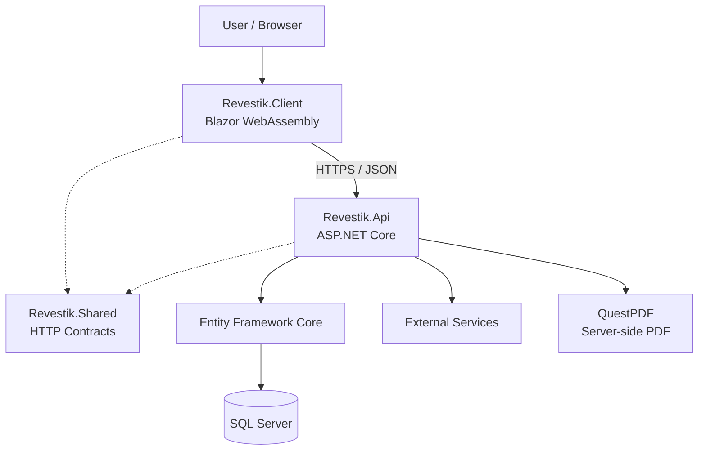
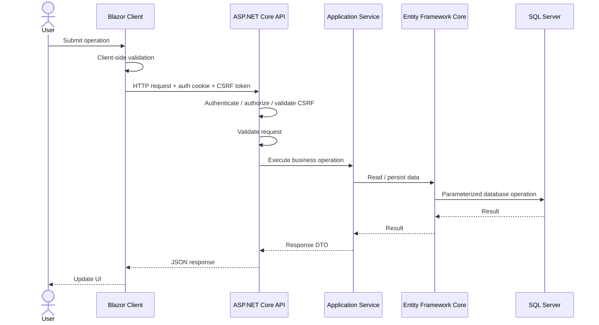
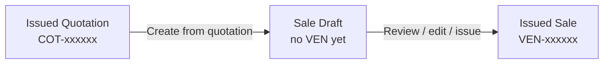
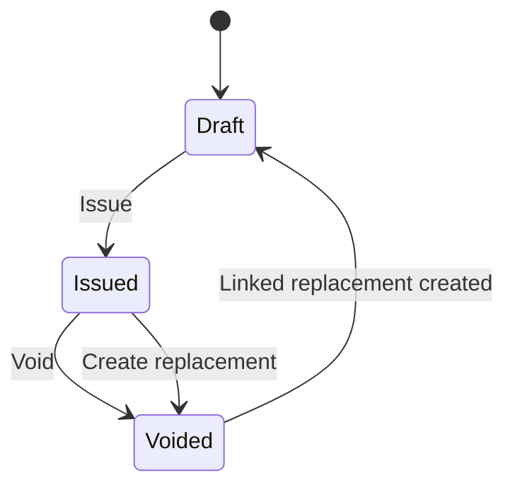

# Architecture Overview

## 1. Purpose

This document describes the current high-level architecture of Revestik.

Revestik is a full-stack business management web application built with .NET and Blazor. The application separates the browser client, server-side API, shared contracts, persistence, authentication, document generation, and external integrations while remaining within a single solution.

This document reflects implemented architecture. Planned functionality is documented separately.

## 2. Solution Structure

```text
Revestik
├── src
│   ├── Revestik.Client
│   ├── Revestik.Api
│   └── Revestik.Shared
├── tests
│   └── Revestik.Api.Tests
└── docs
```

### Revestik.Client

`Revestik.Client` is the Blazor WebAssembly frontend.

Responsibilities include:

* Rendering the user interface.
* Managing navigation and UI state.
* Client-side form validation and calculation feedback.
* Communicating with the API through typed HTTP services.
* Managing client authentication state.
* Obtaining/sending antiforgery tokens for protected mutable requests.
* Downloading server-generated documents through authenticated HTTP flows and JavaScript interop.
* Reusing commercial UI components such as customer and product selectors.

The client does not access SQL Server directly and is not a trusted security boundary.

### Revestik.Api

`Revestik.Api` is the trusted ASP.NET Core server application.

Responsibilities include:

* HTTP API endpoints.
* Authentication and authorization.
* Server-side validation.
* Antiforgery protection.
* Business/application services.
* EF Core database access.
* External service integrations.
* Server-side document generation.
* Hosting the published Blazor WebAssembly application.
* Health checks and production-host configuration.

### Revestik.Shared

`Revestik.Shared` contains request/response contracts shared between the client and API.

Current contract areas include authentication, customers, quotations, sales, products, locations, taxpayer information, and common response structures such as pagination.

Persistence entities remain server-side.

### Revestik.Api.Tests

`Revestik.Api.Tests` contains automated verification for server behavior, persistence, security, and hosting.

Current areas include customers, products, quotations, sales, authentication/CSRF, SQL Server integration, concurrency, PDF behavior, and hosting.

## 3. High-Level Architecture



## 4. Request Flow



Read-only requests do not require antiforgery validation.

Business-critical rules remain server-enforced even when the client reproduces validation or calculations for user experience.

## 5. Persistence

Revestik uses EF Core with SQL Server.

`RevestikDbContext` also integrates ASP.NET Core Identity persistence.

Entity configuration is separated using `IEntityTypeConfiguration<T>` implementations.

Data integrity is enforced at multiple levels where appropriate:

1. Request validation.
2. Server-side application logic.
3. EF Core configuration.
4. SQL Server constraints/indexes.

SQL Server sequences are used where commercial consecutive generation must remain safe under concurrency.

## 6. Commercial Architecture

Quotations and Sales use the same Client/API/Shared architectural pattern while remaining separate business documents.

### Quotations

```text
Quotes.razor / QuotesHistory.razor
        ↓
IQuotationApiService
        ↓
QuotationApiService
        ↓
QuotationEndpoints
        ↓
IQuotationService
        ↓
QuotationService
        ├── QuotationCalculator
        └── QuotationPdfService
        ↓
Entity Framework Core
        ↓
SQL Server
```

Quotations use `COT-xxxxxx` identifiers, support Draft/Issued states, preserve issued customer snapshots, and remain non-inventory commercial proposals.

### Sales

```text
Sales.razor / SalesHistory.razor
        ↓
ISaleApiService
        ↓
SaleApiService
        ↓
SaleEndpoints
        ↓
ISaleService
        ↓
SaleService
        ├── SaleCalculator
        ├── SqlSaleNumberGenerator
        └── SalePdfService
        ↓
Entity Framework Core
        ↓
SQL Server
```

Sales support Draft/Issued/Voided states, payments, replacement relationships, history queries, summaries, and internal PDF generation.

### Shared Commercial Calculation

Commercial calculations are kept server-authoritative.

Reusable commercial calculation behavior is centralized where practical so Quotations and Sales do not silently diverge on common monetary rules.

Client-side calculations exist for immediate feedback only.

## 7. Quotation-to-Sale Conversion

An issued quotation may become the source of a Sale Draft.

Conceptually:



The quotation remains persisted and historical after conversion.

The Sale stores the quotation relationship through `SourceQuotationId`.

Quotation history can therefore display that a quotation was converted without introducing a separate persisted `Converted` quotation status.

## 8. Sale Lifecycle



A Draft does not have an official `VEN` number.

The VEN is generated when the sale is issued.

A replacement does not overwrite the original sale. The original remains historical and the new linked Draft may be corrected and issued with a different VEN.

## 9. Payment Architecture

Payments belong to Sales.

A Sale may have zero or more payment records.

The current balance model exposes:

* `Pending`
* `PartiallyPaid`
* `Paid`

Payments may be voided while preserving their history.

The Sale response exposes authoritative paid and outstanding totals.

Broader accounts-receivable behavior may evolve later if business requirements exceed this sale-centered model.

## 10. Commercial PDF Generation

Quotation and Sale PDFs are generated in the backend using QuestPDF.

The browser requests the authenticated document endpoint and downloads the returned bytes.

Draft Sales do not have an official sale PDF because they do not yet have a VEN.

## 11. Authentication and Authorization

Revestik uses ASP.NET Core Identity with cookie-based authentication.

The application follows a protected-by-default model.

Roles/policies restrict privileged operations, including quotation and sale management.

Applicable mutable authenticated requests are protected with antiforgery validation.

Detailed behavior is documented in:

```text
docs/security/security-overview.md
```

## 12. Hosted Application Model

During local development, Client and API run on separate development origins.

For the published application, ASP.NET Core serves the compiled Blazor WebAssembly application and the API.

Blazor routes use SPA fallback behavior while unknown `/api/*` routes remain API responses rather than returning `index.html`.

## 13. External Integrations

External systems are kept behind server-side boundaries.

Current integrations include taxpayer/location-related services.

Future integrations should use the same server-side trust boundary.

## 14. Deferred Electronic Invoicing Boundary

Direct Costa Rican electronic invoicing is not part of the current architecture.

Internal Sales (`VEN`) are not fiscal electronic invoices.

If electronic invoicing is revisited, fiscal signing credentials, API credentials, signing operations, and Ministerio de Hacienda communication must remain exclusively server-side.

## 15. Testing and Continuous Integration

Automated tests are maintained in `Revestik.Api.Tests`.

Current coverage includes Customers, Products, Quotations, Sales, authentication/CSRF, SQL Server integration, concurrency, PDFs, and hosting.

Current local verified baseline:

**257 passed, 0 failed.**

Current CI:

1. Restores dependencies.
2. Builds Release.
3. Runs automated tests.
4. Publishes the hosted application.
5. Verifies required Blazor/runtime/static assets.

## 16. Architectural Principles

### Separation of concerns

Frontend presentation, HTTP contracts, server behavior, persistence, document generation, and tests have distinct responsibilities.

### Server as the trust boundary

The browser is never trusted to enforce business/security rules or protect secrets.

### Defense in depth

Critical invariants can be protected through validation, application logic, EF configuration, and database constraints.

### Explicit contracts

Client/API communication uses shared contracts rather than persistence entities.

### Traceability over destructive mutation

Historical commercial documents are preserved. Conversion, voiding, payment correction, and sale replacement retain traceable relationships instead of deleting or overwriting important history.

### Incremental complexity

New infrastructure and abstractions should solve concrete requirements rather than exist only to imitate a reference architecture.

### Scope discipline

Deferred integrations should not delay completion and production hardening of the core business application.

## 17. Current Architectural Classification

Revestik is a modular full-stack .NET application with:

* Blazor WebAssembly client.
* ASP.NET Core API/application host.
* Shared HTTP contracts.
* Server-side separation by responsibility.
* EF Core and SQL Server persistence.
* ASP.NET Core Identity.
* Backend-generated commercial PDFs.
* SQL Server-backed commercial numbering.
* Automated server, persistence, security, concurrency, and hosting tests.

It is intentionally not implemented as independently deployable microservices.

The current structure keeps deployment and development complexity proportional to the application's actual requirements.