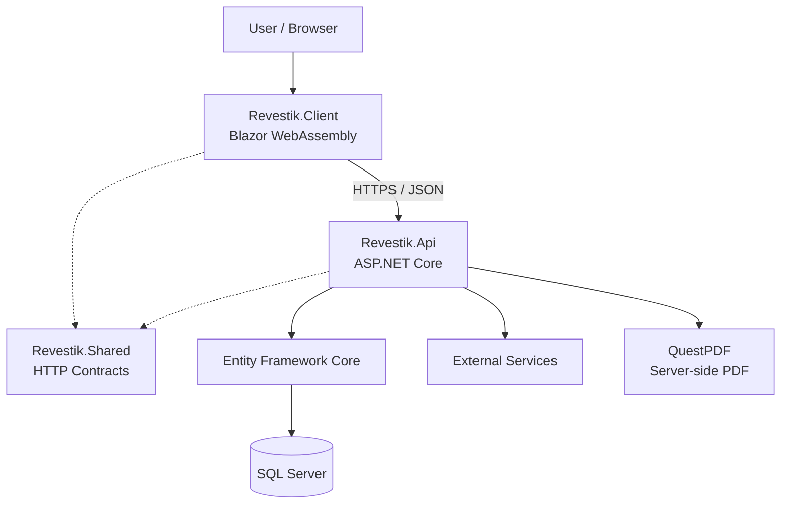
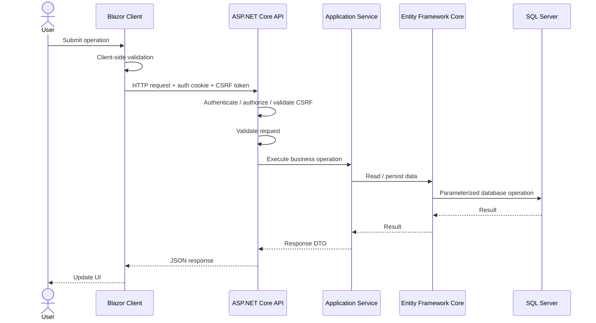

# Architecture Overview

## 1. Purpose

This document describes the current high-level architecture of Revestik.

Revestik is a full-stack business management web application built with .NET and Blazor. The application separates the browser client, server-side API, shared contracts, persistence, authentication, document generation, and external integrations while remaining within a single solution.

This document reflects implemented architecture. Planned functionality is documented separately.

## 2. Solution Structure

```text
Revestik
├── src
│   ├── Revestik.Client
│   ├── Revestik.Api
│   └── Revestik.Shared
├── tests
│   └── Revestik.Api.Tests
└── docs
```

### Revestik.Client

`Revestik.Client` is the Blazor WebAssembly frontend.

Responsibilities include:

* Rendering the user interface.
* Managing navigation and UI state.
* Client-side form validation and calculation feedback.
* Communicating with the API through HTTP services.
* Managing client authentication state.
* Obtaining/sending antiforgery tokens for protected mutable requests.
* Downloading server-generated documents through authenticated HTTP flows and JavaScript interop where required.

The client does not access SQL Server directly and is not a trusted security boundary.

### Revestik.Api

`Revestik.Api` is the trusted ASP.NET Core server application.

Responsibilities include:

* HTTP API endpoints.
* Authentication and authorization.
* Server-side validation.
* Antiforgery protection.
* Business/application services.
* EF Core database access.
* External service integrations.
* Server-side document generation.
* Hosting the published Blazor WebAssembly application.
* Health checks and production-host configuration.

Internal organization includes responsibilities such as:

```text
Endpoints
Services
Data
Models
Authorization
Integrations
```

### Revestik.Shared

`Revestik.Shared` contains request/response contracts shared between the client and API.

Current contract areas include authentication, customers, quotations, products, locations, taxpayer information, and common response structures such as pagination.

Persistence entities remain server-side.

### Revestik.Api.Tests

`Revestik.Api.Tests` contains automated verification for server behavior, persistence, security, and hosting.

Current areas include customers, products, quotations, authentication/CSRF, SQL Server integration, concurrency, and hosting.

## 3. High-Level Architecture



## 4. Request Flow



Read-only requests do not require antiforgery validation.

Business-critical rules remain server-enforced even when the client reproduces validation or calculations for user experience.

## 5. Persistence

Revestik uses EF Core with SQL Server.

`RevestikDbContext` also integrates ASP.NET Core Identity persistence.

Entity configuration is separated using `IEntityTypeConfiguration<T>` implementations.

Data integrity is enforced at multiple levels where appropriate:

1. Request validation.
2. Server-side application logic.
3. EF Core configuration.
4. SQL Server constraints/indexes.

## 6. Quotations Architecture

Quotations extend the existing Client/API/Shared structure without introducing a new architectural layer.

The current flow is conceptually:

```text
Quotes.razor / Quotes.razor.cs
        ↓
IQuotationApiService
        ↓
QuotationApiService
        ↓
QuotationEndpoints
        ↓
IQuotationService
        ↓
QuotationService
        ├── QuotationCalculator
        ├── product lookup/support
        └── QuotationPdfService
        ↓
Entity Framework Core
        ↓
SQL Server
```

Quotation request/response contracts live in `Revestik.Shared`.

The server remains authoritative for monetary calculations and persisted state.

### Consecutive Number Generation

Quotation numbers are generated through SQL Server-backed sequence infrastructure.

Current commercial format:

```text
COT-000001
```

The number is generated when the quotation is created and preserved when the quotation is edited or reissued.

Concurrent sequence behavior is verified against SQL Server.

### Customer Snapshot

When a quotation is issued or reissued, customer information required by the quotation document is persisted as a snapshot.

This allows the commercial document to remain stable if the Customer record changes later.

### Product-Assisted Lines

Quotation lines may reference a registered product or remain manual.

Product lookup is a supporting capability and does not imply that the complete Inventory domain or stock-movement model has been implemented.

### PDF Generation

Commercial quotation PDFs are generated exclusively in the backend through `QuotationPdfService` using QuestPDF.

The client requests the document from the authenticated API and downloads the returned bytes through JavaScript Blob handling.

The browser does not hold PDF-generation authority.

## 7. Authentication and Authorization

Revestik uses ASP.NET Core Identity with cookie-based authentication.

The application follows a protected-by-default model.

Roles/policies restrict privileged operations.

Applicable mutable authenticated requests are protected with antiforgery validation.

Detailed behavior is documented in:

```text
docs/security/security-overview.md
```

## 8. Hosted Application Model

During local development, Client and API may run on separate development origins.

For the published application, ASP.NET Core serves the compiled Blazor WebAssembly application and the API.

Blazor routes use SPA fallback behavior while unknown `/api/*` routes remain API responses rather than returning `index.html`.

## 9. External Integrations

External systems are kept behind server-side boundaries.

This prevents secrets or privileged external communication from being exposed to Blazor WebAssembly.

Current integrations include taxpayer/location-related services.

Future integrations should use the same server-side trust boundary.

## 10. Deferred Electronic Invoicing Boundary

Direct Costa Rican electronic invoicing is not part of the current architecture.

If revisited, fiscal signing credentials, API credentials, signing operations, and Ministerio de Hacienda communication must remain exclusively server-side.

The current architecture intentionally avoids introducing that regulatory integration before the core application is production-proven.

## 11. Testing and Continuous Integration

Automated tests are maintained in `Revestik.Api.Tests`.

Current CI:

1. Restores dependencies.
2. Builds Release.
3. Runs automated tests.
4. Publishes the hosted application.
5. Verifies required Blazor/runtime/static assets.

Current local verified baseline:

**194 passed, 0 failed, 0 skipped.**

## 12. Architectural Principles

### Separation of concerns

Frontend presentation, HTTP contracts, server behavior, persistence, document generation, and tests have distinct responsibilities.

### Server as the trust boundary

The browser is never trusted to enforce business/security rules or protect secrets.

### Defense in depth

Critical invariants can be protected through validation, application logic, EF configuration, and database constraints.

### Explicit contracts

Client/API communication uses shared contracts rather than persistence entities.

### Incremental complexity

New infrastructure and abstractions should solve concrete requirements rather than exist only to imitate a reference architecture.

### Scope discipline

Deferred integrations should not delay completion and production hardening of the core business application.

## 13. Current Architectural Classification

Revestik is a modular full-stack .NET application with:

* Blazor WebAssembly client.
* ASP.NET Core API/application host.
* Shared HTTP contracts.
* Server-side separation by responsibility.
* EF Core and SQL Server persistence.
* ASP.NET Core Identity.
* Backend-generated commercial PDFs.
* Automated server, persistence, security, and hosting tests.

It is intentionally not implemented as independently deployable microservices.

The current structure keeps deployment and development complexity proportional to the application's actual requirements.
