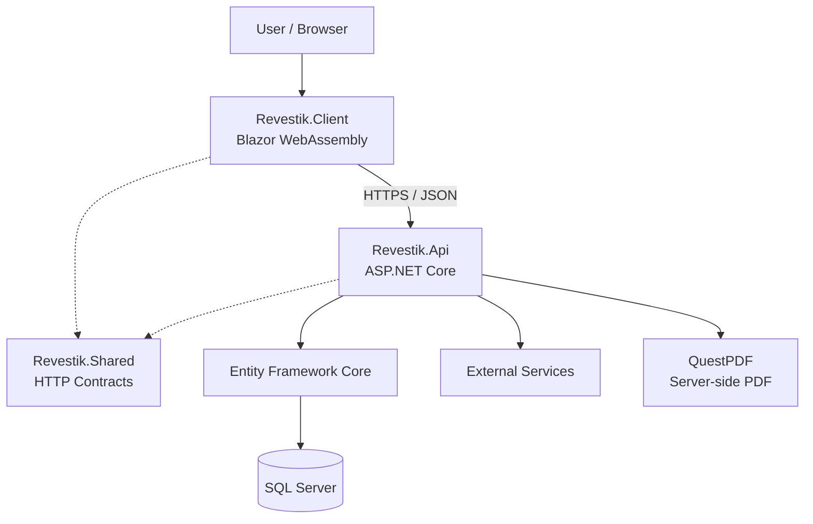
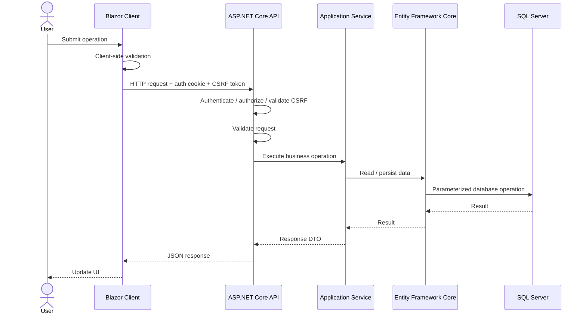
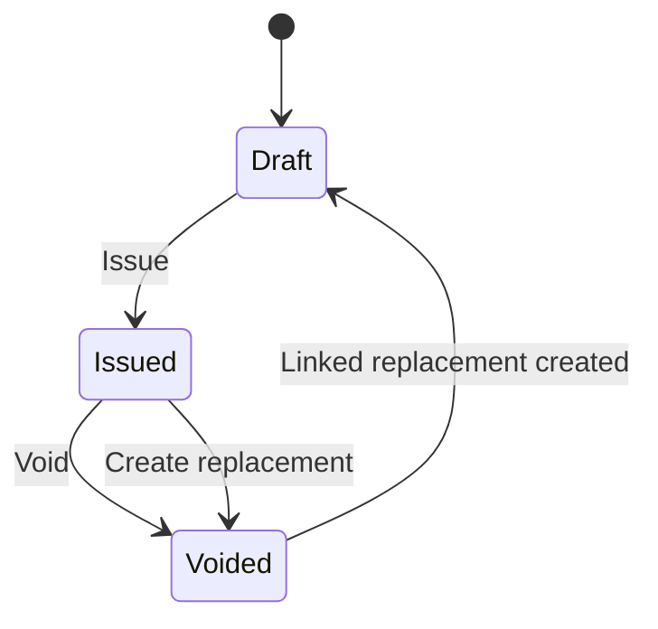
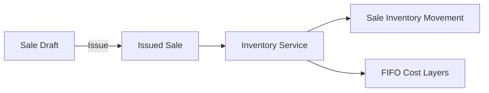
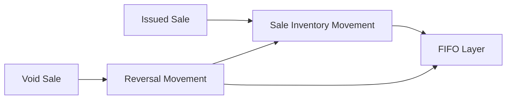

# Architecture Overview

## 1. Purpose

This document describes the current high-level architecture of Revestik.

Revestik is a full-stack business management web application built with .NET and Blazor. The application separates the browser client, server-side API, shared contracts, persistence, authentication, document generation, inventory behavior, and external integrations while remaining within a single solution.

This document reflects implemented architecture. Planned functionality is documented separately.

## 2. Solution Structure

```text
Revestik
├── src
│   ├── Revestik.Client
│   ├── Revestik.Api
│   └── Revestik.Shared
├── tests
│   └── Revestik.Api.Tests
└── docs
```

### Revestik.Client

`Revestik.Client` is the Blazor WebAssembly frontend.

Responsibilities include:

* Rendering the user interface.
* Managing navigation and UI state.
* Client-side form validation and calculation feedback.
* Communicating with the API through typed HTTP services.
* Managing client authentication state.
* Obtaining/sending antiforgery tokens for protected mutable requests.
* Downloading server-generated documents through authenticated HTTP flows and JavaScript interop.
* Reusing commercial UI components such as customer and product selectors.
* Exposing Inventory, Physical Count, and Unknown Inventory Cost workflows without becoming authoritative for stock or cost rules.

The client does not access SQL Server directly and is not a trusted security boundary.

### Revestik.Api

`Revestik.Api` is the trusted ASP.NET Core server application.

Responsibilities include:

* HTTP API endpoints.
* Authentication and authorization.
* Server-side validation.
* Antiforgery protection.
* Business/application services.
* Inventory movement and FIFO logic.
* Inventory cost-layer behavior.
* Physical-count processing.
* EF Core database access.
* External service integrations.
* Server-side document generation.
* Hosting the published Blazor WebAssembly application.
* Health checks and production-host configuration.

### Revestik.Shared

`Revestik.Shared` contains request/response contracts shared between the client and API.

Current contract areas include authentication, customers, quotations, sales, products, inventory, physical counts, inventory cost resolution, locations, taxpayer information, and common response structures such as pagination.

Persistence entities remain server-side.

### Revestik.Api.Tests

`Revestik.Api.Tests` contains automated verification for server behavior, persistence, security, inventory integrity, and hosting.

Current areas include customers, products, quotations, sales, inventory movements, FIFO behavior, cost resolution, physical counts, authentication/CSRF, SQL Server integration, concurrency, PDF behavior, and hosting.

## 3. High-Level Architecture


```mermaid
flowchart TB
    User[User / Browser]
    Client[Revestik.Client<br/>Blazor WebAssembly]
    Api[Revestik.Api<br/>ASP.NET Core]
    Shared[Revestik.Shared<br/>HTTP Contracts]
    EF[Entity Framework Core]
    DB[(SQL Server)]
    External[External Services]
    Pdf[QuestPDF<br/>Server-side PDF]

    User --> Client
    Client -->|HTTPS / JSON| Api
    Client -.-> Shared
    Api -.-> Shared
    Api --> EF
    EF --> DB
    Api --> External
    Api --> Pdf
```

The application remains a single deployable full-stack system.

Business domains are separated through explicit models, services, endpoints, contracts, and persistence configuration without introducing independent microservices.

## 4. Request Flow


```mermaid
sequenceDiagram
    actor User
    participant Client as Blazor Client
    participant API as ASP.NET Core API
    participant Service as Application Service
    participant EF as Entity Framework Core
    participant DB as SQL Server

    User->>Client: Submit operation
    Client->>Client: Client-side validation
    Client->>API: HTTP request + auth cookie + CSRF token
    API->>API: Authenticate / authorize / validate CSRF
    API->>API: Validate request
    API->>Service: Execute business operation
    Service->>EF: Read / persist data
    EF->>DB: Parameterized database operation
    DB-->>EF: Result
    EF-->>Service: Result
    Service-->>API: Response DTO
    API-->>Client: JSON response
    Client-->>User: Update UI
```

Read-only requests do not require antiforgery validation.

Business-critical rules remain server-enforced even when the client reproduces validation or calculations for user experience.

## 5. Persistence

Revestik uses EF Core with SQL Server.

`RevestikDbContext` also integrates ASP.NET Core Identity persistence.

Entity configuration is separated using `IEntityTypeConfiguration<T>` implementations.

Data integrity is enforced at multiple levels where appropriate:

1. Request validation.
2. Server-side application logic.
3. EF Core configuration.
4. SQL Server constraints/indexes.

SQL Server sequences are used where commercial consecutive generation must remain safe under concurrency.

The persistence model also supports inventory-specific integrity through:

* Immutable inventory movement history.
* FIFO inventory cost layers.
* Filtered/unique indexes where required.
* Relationships between sale inventory movements and reversal movements.
* Physical-count records and lines.
* Product lifecycle state including logical archival.
* Concurrency protection for critical product and inventory operations.

Operations that coordinate multiple dependent inventory changes use transactional boundaries where partial completion would corrupt state.

## 6. Commercial Architecture

Quotations and Sales use the same Client/API/Shared architectural pattern while remaining separate business documents.

### Quotations

```text
Quotes.razor / QuotesHistory.razor
        ↓
IQuotationApiService
        ↓
QuotationApiService
        ↓
QuotationEndpoints
        ↓
IQuotationService
        ↓
QuotationService
        ├── QuotationCalculator
        └── QuotationPdfService
        ↓
Entity Framework Core
        ↓
SQL Server
```

Quotations use `COT-xxxxxx` identifiers, support Draft/Issued states, preserve issued customer snapshots, and remain non-inventory commercial proposals.

Quotation creation, editing, issuing, reissuing, and conversion do not reserve or consume stock.

### Sales

```text
Sales.razor / SalesHistory.razor
        ↓
ISaleApiService
        ↓
SaleApiService
        ↓
SaleEndpoints
        ↓
ISaleService
        ↓
SaleService
        ├── SaleCalculator
        ├── SqlSaleNumberGenerator
        └── SalePdfService
        ↓
InventoryService
        ↓
Entity Framework Core
        ↓
SQL Server
```

Sales support Draft/Issued/Voided states, payments, replacement relationships, history queries, summaries, internal PDF generation, and product-linked inventory effects.

Issuing an inventory-backed sale may consume physical stock through the Inventory domain.

Voiding a sale may restore the exact inventory quantities and FIFO layers previously consumed by that sale.

### Shared Commercial Calculation

Commercial calculations are kept server-authoritative.

Reusable commercial calculation behavior is centralized where practical so Quotations and Sales do not silently diverge on common monetary rules.

Client-side calculations exist for immediate feedback only.

## 7. Quotation-to-Sale Conversion

An issued quotation may become the source of a Sale Draft.

Conceptually:


```mermaid
flowchart LR
    Q[Issued Quotation<br/>COT-xxxxxx]
    S[Sale Draft<br/>no VEN yet]
    I[Issued Sale<br/>VEN-xxxxxx]

    Q -->|Create from quotation| S
    S -->|Review / edit / issue| I
```

The quotation remains persisted and historical after conversion.

The Sale stores the quotation relationship through `SourceQuotationId`.

Quotation history can therefore display that a quotation was converted without introducing a separate persisted `Converted` quotation status.

Conversion itself does not consume inventory.

Inventory effects occur only when a valid inventory-backed Sale is issued.

## 8. Sale Lifecycle


```mermaid
stateDiagram-v2
    [*] --> Draft
    Draft --> Issued: Issue
    Issued --> Voided: Void
    Issued --> Voided: Create replacement
    Voided --> Draft: Linked replacement created
```

A Draft does not have an official `VEN` number.

The VEN is generated when the sale is issued.

A replacement does not overwrite the original sale. The original remains historical and the new linked Draft may be corrected and issued with a different VEN.

Where the issued sale consumed inventory, voiding coordinates the Sale lifecycle transition with exact inventory restoration.

## 9. Payment Architecture

Payments belong to Sales.

A Sale may have zero or more payment records.

The current balance model exposes:

* `Pending`
* `PartiallyPaid`
* `Paid`

Payments may be voided while preserving their history.

The Sale response exposes authoritative paid and outstanding totals.

Broader accounts-receivable behavior may evolve later if business requirements exceed this sale-centered model.

## 10. Inventory Architecture

Inventory is implemented as a business domain within the existing modular application rather than as a separate deployable service.

Its responsibilities include:

* Product inventory metadata.
* Physical quantity tracking.
* Inventory movements.
* FIFO consumption.
* FIFO cost layers.
* Manual inventory adjustments.
* Sale-related inventory consumption.
* Exact sale-related inventory reversal.
* Physical inventory counts.
* Unknown historical cost resolution.
* Product inventory lifecycle and archival behavior.

### Inventory Request Path

```text
Inventory.razor
        ↓
Inventory-related client API services
        ↓
InventoryEndpoints / ProductEndpoints
        ↓
InventoryService / ProductService
        ↓
Entity Framework Core
        ↓
SQL Server
```

Additional focused workflows use the same pattern:

```text
PhysicalCount.razor
        ↓
IPhysicalCountApiService
        ↓
PhysicalCountApiService
        ↓
InventoryEndpoints
        ↓
IInventoryPhysicalCountService
        ↓
InventoryPhysicalCountService
        ↓
Entity Framework Core
        ↓
SQL Server
```

```text
UnknownInventoryCosts.razor
        ↓
IInventoryCostApiService
        ↓
InventoryCostApiService
        ↓
InventoryEndpoints
        ↓
IInventoryCostResolutionService
        ↓
InventoryCostResolutionService
        ↓
Entity Framework Core
        ↓
SQL Server
```

## 11. Inventory Movement and FIFO Model

The current Inventory architecture treats current stock and historical movement/cost information as related but distinct concerns.

Conceptually:

```text
Product
  │
  ├── Current stock reference
  │
  ├── InventoryMovement history
  │
  └── InventoryCostLayer history
```

Inventory movements provide traceability for stock-changing operations.

FIFO cost layers track the remaining quantities associated with historical inventory cost sources.

When stock is consumed:

1. The server determines the required physical quantity.
2. Available FIFO layers are evaluated in order.
3. Required quantities are consumed from those layers.
4. Inventory movement history is recorded.
5. Current stock is updated consistently.
6. The operation succeeds or fails as one business transition.

Tracked stock is not allowed to become negative.

## 12. Sale-to-Inventory Integration

Sales and Inventory remain separate domains but coordinate through explicit server-side operations.

Conceptually:


```mermaid
flowchart LR
    Draft[Sale Draft]
    Issued[Issued Sale]
    Inventory[Inventory Service]
    Movement[Sale Inventory Movement]
    Layers[FIFO Cost Layers]

    Draft -->|Issue| Issued
    Issued --> Inventory
    Inventory --> Movement
    Inventory --> Layers
```

Manual sale lines that do not reference an inventory-managed product do not create inventory movements.

Product-linked sale lines use registered product inventory information and unit-conversion rules.

Inventory shortage is not represented by creating artificial negative stock.

## 13. Exact Sale Inventory Reversal

Voiding an issued inventory-backed sale restores the exact inventory provenance originally consumed.

The Inventory movement model supports:

* Optional `SaleId`.
* Optional `ReversesInventoryMovementId`.
* A reversal relationship from a reversal movement to the original Sale movement.
* Protection against reversing the same original movement more than once.

Conceptually:


```mermaid
flowchart LR
    Sale[Issued Sale]
    Consume[Sale Inventory Movement]
    Layer[FIFO Layer]
    Void[Void Sale]
    Reverse[Reversal Movement]

    Sale --> Consume
    Consume --> Layer
    Void --> Reverse
    Reverse --> Consume
    Reverse --> Layer
```

The reversal restores quantity to the original FIFO layers rather than creating unrelated replacement layers.

Sale voiding and its required inventory restoration occur within the same critical business transition.

If the original inventory state cannot support a valid reversal, the operation fails rather than applying a partial or inconsistent restoration.

## 14. Inventory Cost Architecture

Inventory historical cost is represented through cost layers.

An original cost source remains immutable.

A layer may therefore contain:

```text
UnitCost
ResolvedUnitCost
ResolvedByUserId
ResolvedAtUtc
RemainingQuantity
```

Effective cost follows the implemented rule:

```text
UnitCost ?? ResolvedUnitCost
```

This allows quantities with unknown historical cost to remain explicitly unknown until a user resolves them.

Resolving an unknown cost does not overwrite the original `UnitCost`.

The current product cost is treated as a current reference and does not rewrite historical inventory cost layers.

## 15. Physical Count Architecture

Physical inventory counts are modeled explicitly rather than directly overwriting stock.

The model includes:

```text
InventoryPhysicalCount
        │
        └── InventoryPhysicalCountLine
                └── Product
```

A count captures physical quantities for products.

When the count identifies a difference between system stock and physical stock, the application produces a traceable inventory adjustment.

The adjustment retains its relationship to the originating physical count.

Physical-count lifecycle state controls which operations remain valid.

## 16. Product Lifecycle and Archival

Product lifecycle uses persisted state instead of destructive deletion from historical data.

The current model distinguishes:

```text
Active
IsDeleted = false
IsArchived = false

Discontinued
IsDeleted = true
IsArchived = false

Permanently removed from normal product workflows
IsDeleted = true
IsArchived = true
```

The user-facing permanent-delete operation is therefore logical archival.

Archived products:

* Remain in the database.
* Preserve historical references.
* Are excluded from normal Active, Discontinued, and All product listings.
* Cannot be reactivated through the normal product-management workflow.
* Do not require historical records to be physically deleted.

This preserves operational history while allowing the product to disappear permanently from normal product management.

## 17. Inventory Domain Boundary

Inventory owns physical stock behavior.

It does not own:

* Supplier management.
* Purchase-document lifecycle.
* Email ingestion.
* Costa Rican XML 4.4 parsing.
* Fiscal document classification.

Those responsibilities belong to future Purchases workflows.

The architectural boundary is intentional: external document ingestion or purchase processing should produce explicit valid inventory effects rather than making Inventory responsible for unrelated integration concerns.

## 18. Commercial PDF Generation

Quotation and Sale PDFs are generated in the backend using QuestPDF.

The browser requests the authenticated document endpoint and downloads the returned bytes.

Draft Sales do not have an official sale PDF because they do not yet have a VEN.

## 19. Authentication and Authorization

Revestik uses ASP.NET Core Identity with cookie-based authentication.

The application follows a protected-by-default model.

Roles/policies restrict privileged operations, including quotation, sale, product, and inventory management.

Applicable mutable authenticated requests are protected with antiforgery validation.

Detailed behavior is documented in:

```text
docs/security/security-overview.md
```

## 20. Hosted Application Model

During local development, Client and API run on separate development origins.

For the published application, ASP.NET Core serves the compiled Blazor WebAssembly application and the API.

Blazor routes use SPA fallback behavior while unknown `/api/*` routes remain API responses rather than returning `index.html`.

## 21. External Integrations

External systems are kept behind server-side boundaries.

Current integrations include taxpayer/location-related services.

Future integrations should use the same server-side trust boundary.

Inventory itself does not directly integrate with external fiscal/email systems.

## 22. Deferred Electronic Invoicing Boundary

Direct Costa Rican electronic invoicing is not part of the current architecture.

Internal Sales (`VEN`) are not fiscal electronic invoices.

If electronic invoicing is revisited, fiscal signing credentials, API credentials, signing operations, and Ministerio de Hacienda communication must remain exclusively server-side.

## 23. Testing and Continuous Integration

Automated tests are maintained in `Revestik.Api.Tests`.

Current coverage includes:

* Customers.
* Products.
* Quotations.
* Sales.
* Sale inventory consumption and reversal.
* Inventory movements.
* Inventory data-integrity behavior.
* FIFO and inventory costs.
* Unknown-cost resolution.
* Physical counts.
* Unit quantity rules.
* Authentication and CSRF.
* SQL Server integration.
* Concurrency.
* PDF behavior.
* Hosting.

Current local verified baseline:

**439 passed, 0 failed.**

Current CI:

1. Restores dependencies.
2. Builds Release.
3. Runs automated tests.
4. Publishes the hosted application.
5. Verifies required Blazor/runtime/static assets.

## 24. Architectural Principles

### Separation of concerns

Frontend presentation, HTTP contracts, server behavior, persistence, inventory logic, document generation, and tests have distinct responsibilities.

### Server as the trust boundary

The browser is never trusted to enforce business/security rules or protect secrets.

### Defense in depth

Critical invariants can be protected through validation, application logic, EF configuration, database constraints, filtered indexes, and transactional operations.

### Explicit contracts

Client/API communication uses shared contracts rather than persistence entities.

### Traceability over destructive mutation

Historical commercial and inventory records are preserved.

Conversion, voiding, payment correction, sale replacement, inventory movements, sale inventory reversal, physical counts, and product archival retain traceable relationships instead of deleting or overwriting important history.

### Atomic critical transitions

Business operations that require multiple dependent persistence changes should not leave partially applied state.

Sale inventory consumption and exact sale-void inventory reversal are examples of transitions that require coordinated persistence.

### Domain ownership

Each domain should own its own business responsibility.

Sales owns commercial sale behavior.

Inventory owns physical stock behavior.

Cross-domain operations should coordinate through explicit application behavior rather than duplicating business rules across unrelated modules.

### Incremental complexity

New infrastructure and abstractions should solve concrete requirements rather than exist only to imitate a reference architecture.

### Scope discipline

Deferred integrations should not delay completion and production hardening of the core business application.

## 25. Current Architectural Classification

Revestik is a modular full-stack .NET application with:

* Blazor WebAssembly client.
* ASP.NET Core API/application host.
* Shared HTTP contracts.
* Server-side separation by responsibility.
* EF Core and SQL Server persistence.
* ASP.NET Core Identity.
* Backend-generated commercial PDFs.
* SQL Server-backed commercial numbering.
* Product and inventory domain services.
* FIFO inventory cost-layer behavior.
* Traceable inventory movements.
* Physical-count workflows.
* Automated server, persistence, security, inventory, concurrency, and hosting tests.

It is intentionally not implemented as independently deployable microservices.

The current structure keeps deployment and development complexity proportional to the application's actual requirements.