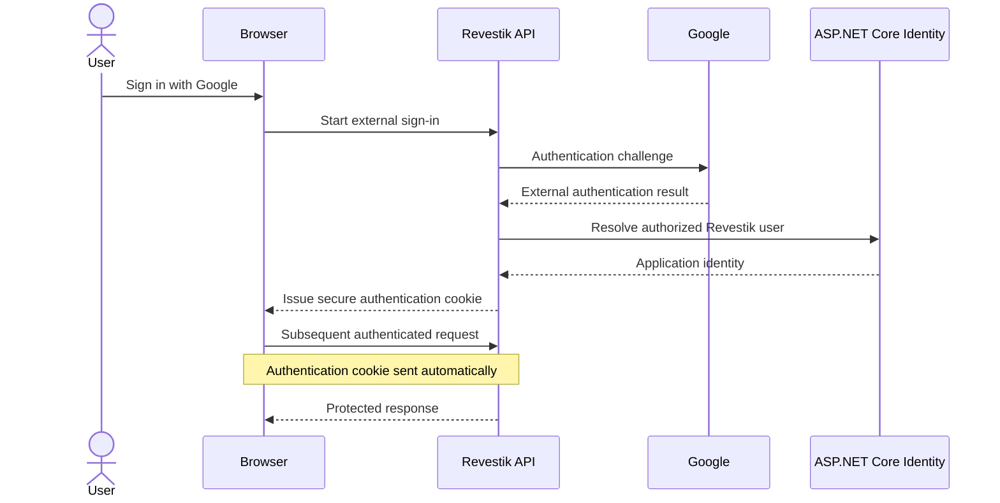

# ADR-002: Use Cookie-Based Authentication for Application Sessions

**Status:** Accepted
**Date:** 2026-09-12

## Context

Revestik is a browser-based business application built with Blazor WebAssembly and ASP.NET Core.

The application requires authenticated access to protected business information and supports external sign-in through Google.

A mechanism is required to maintain the authenticated Revestik session after the user's identity has been established.

The primary alternatives considered were:

* Cookie-based authentication.
* Bearer tokens such as JWTs.

## Decision

Revestik will use ASP.NET Core Identity with secure cookie-based authentication for application sessions.

Google may be used as an external identity provider during the sign-in process, but Google authentication and the Revestik application session are separate concerns.

The general model is:



The external provider establishes external identity.

Revestik remains responsible for determining whether that identity corresponds to an authorized application user and what permissions that user has.

## Rationale

Cookie authentication is appropriate for the current Revestik architecture because the primary client is a browser application communicating with its own ASP.NET Core backend.

The application is deployed using a hosted same-origin model in production, which makes secure server-managed cookies a natural session mechanism.

ASP.NET Core Identity also provides mature support for cookie authentication, account management, lockout behavior, external providers, roles, and authorization.

Using JWT bearer tokens would introduce token issuance, storage, expiration, refresh, revocation, and client-handling concerns without currently solving a requirement that Revestik has.

## Why JWT Was Not Selected

JWT is useful in architectures where bearer tokens provide a concrete benefit, such as:

* Independent APIs consumed by multiple unrelated clients.
* Mobile applications.
* Service-to-service authentication.
* Distributed systems requiring portable bearer credentials.
* APIs intentionally designed for third-party consumers.

Those requirements do not currently describe Revestik.

Using JWT solely because the frontend is Blazor WebAssembly would not by itself justify the additional authentication complexity.

## CSRF Consequence

Authentication cookies are automatically included by browsers when their cookie rules permit it.

Because of this behavior, state-changing authenticated operations require protection against Cross-Site Request Forgery.

Revestik therefore uses ASP.NET Core antiforgery protection for applicable mutable requests.

Conceptually:

```text
Authentication cookie
        +
Antiforgery token
        ↓
Protected mutable request
```

Authentication and antiforgery protection solve different problems.

The authentication cookie establishes the user's authenticated session.

The antiforgery token helps protect that authenticated session from unauthorized cross-site state-changing requests.

## Security Requirements

Authentication cookies should use appropriate protections, including:

* `HttpOnly`.
* `Secure`.
* Appropriate `SameSite` configuration.

Application secrets associated with external authentication providers must remain server-side and must not be included in Blazor WebAssembly assets or committed to source control.

Authorization must continue to be enforced by the server regardless of what the client interface displays.

## Alternatives Considered

### JWT Bearer Authentication

JWT bearer tokens were considered but not selected for the current architecture.

Advantages could include:

* Explicit bearer credentials.
* Easier use by some non-browser clients.
* Portable claims.
* Suitability for certain distributed API architectures.

Current disadvantages for Revestik include:

* Additional token lifecycle management.
* Refresh-token design.
* Revocation complexity.
* Secure browser storage considerations.
* Additional client authentication logic.
* No current architectural requirement for portable bearer tokens.

### Custom Session Implementation

Building a custom authentication/session system was rejected.

ASP.NET Core Identity already provides established mechanisms for authentication, account management, external providers, cookies, roles, and security-related behavior.

Implementing these mechanisms independently would add security risk without providing a clear product benefit.

## Consequences

### Positive

* Strong integration with ASP.NET Core Identity.
* Authentication session managed by the server.
* Authentication cookie can be `HttpOnly`.
* Natural fit for the hosted browser application.
* Straightforward integration with server authorization.
* External identity providers can be integrated without changing the application session model.

### Negative

* CSRF protection is required for applicable state-changing requests.
* Cookie behavior must be considered when changing origins or deployment topology.
* This model is less directly suited to unrelated third-party API consumers than bearer-token authentication.

These trade-offs are acceptable for the current application.

## Future Review Triggers

This decision should be reviewed if Revestik introduces:

* Native mobile clients.
* Public APIs.
* Third-party API consumers.
* Independently deployed frontend applications on unrelated origins.
* Service-to-service authentication.
* A distributed architecture requiring portable access tokens.

Such a review does not automatically mean JWT should replace cookies.

The authentication mechanism should be selected according to the requirements of each client and trust boundary.
