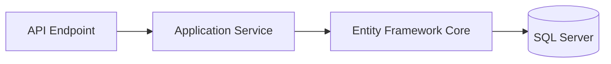

# ADR-003: Use Entity Framework Core with SQL Server

**Status:** Accepted
**Date:** 2026-09-12

## Context

Revestik manages structured business data including customers, authentication information, locations, quotations, sales, payments, products, inventory movements, inventory cost layers, physical inventory counts, and other operational records.

Future domains such as purchases, suppliers, expenses, reporting, and broader receivables will build on this persistence foundation.

The persistence solution must support:

* Relational data.
* Referential integrity.
* Transactions.
* Unique constraints.
* Filtered and supporting indexes.
* Schema evolution.
* Querying, filtering, ordering, and pagination.
* Concurrency-sensitive operations.
* Integration with ASP.NET Core Identity.
* Reliable enforcement of important data invariants.
* Traceable transactional history.

The application also requires a persistence approach that integrates naturally with the .NET ecosystem.

## Decision

Revestik will use:

* **Entity Framework Core** as the primary application data-access technology.
* **Microsoft SQL Server** as the relational database.

Database schema evolution will be managed through EF Core migrations.

Entity-specific persistence rules should be configured through EF Core configuration classes where practical rather than placing all configuration directly inside the `DbContext`.

The general persistence flow is:



EF Core remains the normal application persistence abstraction.

SQL Server remains responsible for final relational enforcement of database-level constraints, indexes, relationships, and transactional consistency.

## Rationale

Revestik's data is primarily relational.

Implemented business domains such as customers, quotations, sales, payments, products, inventory movements, inventory cost layers, and physical counts require relationships, constraints, filtering, sorting, concurrency protection, and transactional consistency.

SQL Server provides the relational and transactional capabilities required by these workflows.

Entity Framework Core provides a strongly integrated .NET persistence layer with support for:

* LINQ queries.
* Change tracking.
* Transactions.
* Migrations.
* Relationships.
* Constraints and indexes.
* Optimistic concurrency.
* Async database operations.
* ASP.NET Core Identity integration.
* Parameterized database access.

This combination provides sufficient capability for the current application without requiring a custom persistence framework.

The completed Sales and Inventory domains have validated this choice against real transactional requirements rather than only simple CRUD behavior.

## Data Integrity Strategy

Application validation alone is not considered sufficient to protect important persisted data.

Where practical, critical invariants should also be represented in the persistence model.

The protection model is:

```text
Client validation
        ↓
Server request validation
        ↓
Application/business rules
        ↓
EF Core model configuration
        ↓
SQL Server constraints and indexes
```

Each layer has a different responsibility.

The database remains the final authority over persisted relational integrity.

Examples include:

* Required fields.
* Maximum lengths.
* Supported data relationships.
* Unique customer identification numbers.
* Commercial sequence-backed numbering.
* Inventory relationship integrity.
* Filtered uniqueness for inventory reversal provenance.
* Product concurrency protection.
* Inventory cost-layer relationships.
* Physical-count relationships.

Application services remain responsible for business rules that cannot be expressed safely or clearly as database constraints alone.

## Transactional Operations

Revestik uses transactional persistence where a business operation requires several dependent changes to succeed or fail together.

This is especially important for Inventory.

Examples include:

* Issuing an inventory-backed Sale and consuming stock.
* FIFO cost-layer consumption.
* Updating tracked stock and recording inventory movements.
* Voiding an issued Sale and restoring its exact previously consumed inventory.
* Restoring remaining quantities to original FIFO layers.
* Creating traceable reversal movements.
* Applying physical-count adjustments.

A critical operation must not leave partially updated state if one of its required persistence changes fails.

EF Core and SQL Server transactions therefore form part of the integrity model for these workflows.

## Inventory Persistence Model

The Inventory domain demonstrates several persistence requirements that influenced and continue to validate this decision.

### Inventory Movements

Inventory stock-changing operations are represented through persisted movement history.

Movement records support traceability rather than relying only on the current stock quantity.

Sale-related movements may retain a `SaleId`.

Reversal movements may retain a `ReversesInventoryMovementId` pointing to the original Sale inventory movement.

Database indexes and uniqueness rules help prevent invalid duplicate reversal relationships.

### FIFO Cost Layers

Inventory cost is tracked through persisted FIFO cost layers.

Layers preserve:

* Original quantity.
* Remaining quantity.
* Original historical unit cost when known.
* Explicit resolved cost when the original historical cost was unknown.

Historical cost values are not rewritten merely because a product receives a newer current cost.

### Unknown Cost Resolution

An inventory layer may have an unknown original `UnitCost`.

When explicitly resolved, the resolution is stored separately rather than replacing the original source field.

Effective cost follows the application rule:

```text
UnitCost ?? ResolvedUnitCost
```

The persistence model therefore preserves both historical source truth and later administrative resolution.

### Physical Counts

Physical inventory counts and their lines are persisted as explicit records.

Differences between system stock and counted stock generate traceable inventory adjustments rather than silently replacing current quantity.

### Product Lifecycle

Product lifecycle state is persisted.

Current semantics distinguish:

```text
Active
IsDeleted = false
IsArchived = false

Discontinued
IsDeleted = true
IsArchived = false

Archived
IsDeleted = true
IsArchived = true
```

Archival removes the product from normal product workflows without physically deleting the database row or breaking historical relationships.

### Concurrency

Critical product and inventory workflows use concurrency protections where required.

Concurrency conflicts should surface as controlled application behavior rather than silently overwriting newer persisted state.

## Entity Framework Core Usage

Application code should prefer normal EF Core query APIs and LINQ for database operations.

Read-only queries should use `AsNoTracking()` when change tracking is unnecessary and doing so improves clarity or efficiency.

Asynchronous database APIs should be preferred for request-processing paths.

Persistence entities should remain internal server-side implementation details and should not become the public HTTP contract.

Application services may explicitly coordinate EF Core transactions for business operations where multiple related writes must remain atomic.

## SQL Server Features Used by Revestik

SQL Server is used not only as passive storage but also for persistence guarantees that support application invariants.

Current examples include:

* Relational foreign keys.
* Unique indexes.
* Filtered indexes.
* SQL Server sequences for commercial numbering.
* Transactions.
* Concurrency-sensitive writes.
* Decimal persistence for monetary and inventory quantities.
* Constraints and defaults introduced through migrations.

These features should be used intentionally.

Business logic should not be pushed into the database merely because SQL Server can implement it; application-domain rules remain in application services unless persistence enforcement provides a clear integrity benefit.

## SQL Parameterization

Normal EF Core LINQ queries generate parameterized database commands.

Application code must not construct SQL statements by concatenating untrusted user input.

If raw SQL becomes necessary, values must be parameterized and the implementation should receive additional review.

Using EF Core does not make arbitrary raw SQL automatically safe.

## Migrations

Database schema changes are managed using EF Core migrations.

A migration should represent an intentional schema change associated with an application requirement.

Migration files should be version controlled.

Changes involving existing production data must consider:

* Existing rows.
* New required fields.
* Default values.
* Constraint compatibility.
* Index creation.
* Referential relationships.
* Data transformation.
* Existing historical records.
* Rollback/recovery strategy where appropriate.

A migration compiling successfully does not by itself guarantee that it is safe for production data.

Current Inventory development has reinforced the importance of reviewing migrations where new relationships, filtered indexes, lifecycle fields, or data-integrity constraints are introduced.

## ASP.NET Core Identity

The Revestik database context also supports ASP.NET Core Identity persistence.

Using the same relational database infrastructure simplifies the current application architecture and allows Identity to use its established EF Core persistence model.

Identity implementation details must remain server-side.

## Testing Strategy

Persistence behavior that depends on actual SQL Server semantics should be verified against SQL Server rather than assuming an in-memory substitute behaves identically.

Revestik therefore uses SQL Server Testcontainers for relevant integration tests.

Current persistence-oriented coverage includes areas such as:

* Constraints.
* Unique behavior.
* SQL Server sequences.
* Concurrency.
* Inventory movements.
* FIFO behavior.
* Inventory cost layers.
* Sale inventory reversal.
* Inventory data integrity.
* Physical counts.
* Product lifecycle behavior.

This test strategy helps keep persistence assumptions aligned with the production database technology.

## Alternatives Considered

### Direct ADO.NET

Direct ADO.NET would provide lower-level control over database access.

It was not selected as the primary persistence mechanism because Revestik benefits from EF Core's:

* Object mapping.
* LINQ support.
* Migrations.
* Change tracking.
* Relationship management.
* Transaction support.
* Identity integration.
* Model configuration.

ADO.NET may still be appropriate for a specific future requirement if profiling demonstrates a concrete need.

### Dapper

Dapper could provide lightweight object mapping with explicit SQL.

It was not selected as the primary persistence technology because the current application benefits more from EF Core's complete relational model and migration support than from reducing ORM abstraction.

Dapper could be introduced selectively in the future if a measured performance problem justifies it.

### SQLite

SQLite offers a simple deployment model and is useful for smaller or embedded applications.

It was not selected as the primary Revestik database because Revestik is intended to support a multi-user business application and already relies on SQL Server behavior for important persistence concerns.

Using a different database for production would require validation of SQL Server-specific behavior such as sequences, indexes, concurrency behavior, and migrations.

### NoSQL Database

A document-oriented or other NoSQL database was not selected as the primary persistence model.

The current business data has strong relational characteristics and benefits from relational constraints and transactional behavior.

Inventory provenance, cost layers, sales relationships, payments, physical counts, and future purchases all naturally require relational consistency.

Introducing a NoSQL database without a domain-specific requirement would add complexity without a demonstrated advantage.

## Consequences

### Positive

* Strong integration with .NET.
* Relational integrity.
* Database migrations are version controlled.
* Mature tooling.
* LINQ-based querying.
* ASP.NET Core Identity integration.
* Support for indexes and constraints.
* Support for filtered indexes.
* Transaction support for critical business transitions.
* SQL Server sequences for concurrency-safe numbering.
* Parameterized queries through normal EF Core usage.
* Proven suitability for current Sales and Inventory transactional workflows.
* Suitable foundation for forthcoming purchase and supplier workflows.

### Negative

* EF Core introduces ORM behavior that developers must understand.
* Inefficient LINQ can still generate inefficient SQL.
* Change tracking can introduce unnecessary overhead when used incorrectly.
* Long-running or overly broad transactions can create contention.
* Concurrency behavior must be handled explicitly where required.
* Database migrations require care once production data exists.
* The application remains dependent on SQL Server-specific infrastructure and behavior in some areas.

These trade-offs are currently acceptable.

## Performance Considerations

EF Core should not be assumed to make database access automatically efficient.

Database-related performance should be evaluated using evidence.

Potential areas include:

* Generated SQL.
* Query count.
* Index usage.
* Pagination.
* Projection.
* Change tracking.
* Transaction duration.
* Large result sets.
* Relationship loading.
* Database execution plans.
* Inventory/reporting query patterns as data volume grows.

Optimization should be driven by measured problems rather than replacing EF Core preemptively.

The current architecture does not justify introducing a second persistence technology solely for theoretical performance benefits.

## Future Review Triggers

This decision should be reviewed if:

* Measured query performance cannot reasonably be addressed with EF Core.
* A business domain requires a substantially different persistence model.
* Reporting workloads require specialized storage.
* The application introduces large analytical datasets.
* SQL Server operational requirements become inappropriate for the deployment environment.
* Independent services require separate data ownership.
* Transactional contention becomes a demonstrated operational problem.
* Persistence boundaries become difficult to maintain as the application grows.

A future architecture may use more than one persistence technology.

That should happen because a specific workload requires it, not because multiple database technologies are available.

## Decision Principle

Revestik uses EF Core and SQL Server because they fit the application's relational, transactional, and .NET requirements.

The completed Sales and Inventory domains have reinforced rather than invalidated this decision.

Persistence technology should evolve only when application requirements or measured operational evidence justify the change.