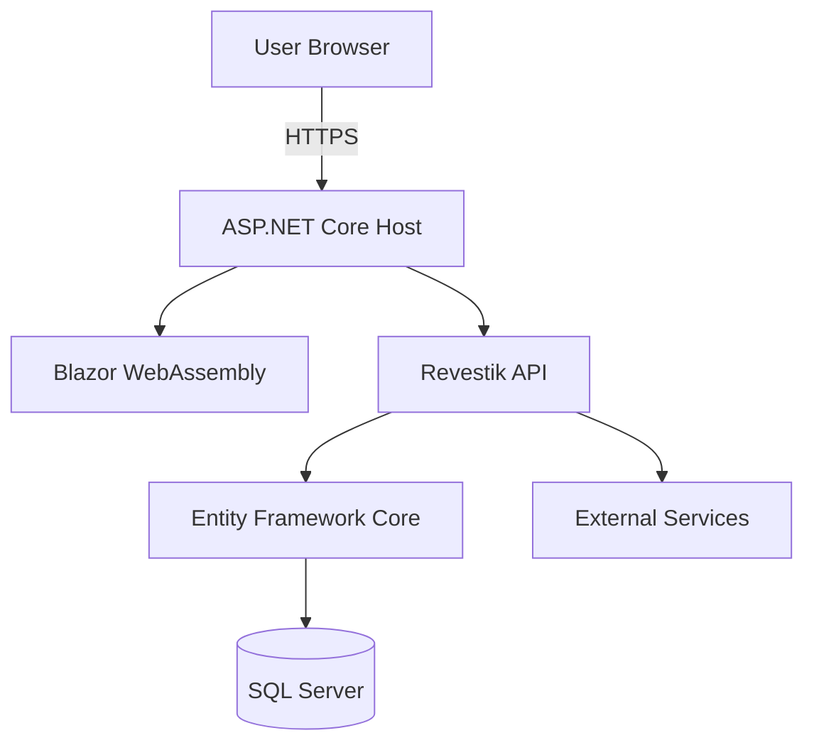
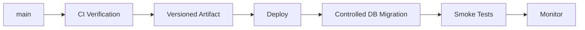

# Deployment Guide

## 1. Purpose

This document describes the current build, publish, configuration, and deployment model for Revestik.

It documents capabilities that exist in the application today and establishes requirements for a future production environment.

A specific cloud hosting platform is not considered part of the architecture until it has been intentionally selected and implemented.

## 2. Current Deployment Status

Revestik can currently:

* Restore dependencies.
* Build in Release configuration.
* Run automated tests.
* Publish the ASP.NET Core application.
* Produce the hosted Blazor WebAssembly application.
* Serve the Blazor client and API from the same ASP.NET Core host.
* Generate compressed static assets.
* Verify important publish artifacts through continuous integration.

The application is therefore **publishable**, but this document does not claim that Revestik currently has a complete production environment.

## 3. Production Architecture

The intended hosted application model is:



The browser downloads the Blazor WebAssembly application from the ASP.NET Core host.

The same host exposes the Revestik API.

This produces a same-origin production topology:

```text
https://revestik.example/
https://revestik.example/api/...
```

rather than requiring separate production origins for the frontend and backend.

## 4. Development vs Production Hosting

Local development and production use different hosting models.

### Development

The client and API run independently:

```text
Blazor Client
https://localhost:7081

ASP.NET Core API
https://localhost:7126
```

Because these are different browser origins, development requires explicit CORS configuration.

### Production

The published client is hosted by the ASP.NET Core application.

Conceptually:

```text
Browser
   ↓
ASP.NET Core
   ├── Blazor static assets
   └── /api/*
```

This reduces production cross-origin complexity.

## 5. Release Build

From the repository root:

```powershell
dotnet restore Revestik.sln
```

Then:

```powershell
dotnet build Revestik.sln `
    --configuration Release `
    --no-restore
```

A deployment candidate must not be created from a failing Release build.

## 6. Automated Tests

Before publishing:

```powershell
dotnet test Revestik.sln `
    --configuration Release `
    --no-build
```

A successful test run does not guarantee production readiness, but a known failing test suite should block a normal deployment.

Additional testing guidance is documented in:

```text
docs/development/testing.md
```

## 7. Publish

The production host is published from `Revestik.Api`.

Example:

```powershell
dotnet publish src/Revestik.Api/Revestik.Api.csproj `
    --configuration Release `
    --no-restore `
    --output artifacts/publish
```

The resulting directory represents the deployable application artifact.

The published API contains the hosted Blazor WebAssembly application.

## 8. Published Application

A successful publish should contain the ASP.NET Core application and the client static assets required by Blazor.

Important examples include:

```text
artifacts/publish/
└── wwwroot/
    ├── index.html
    └── _framework/
        ├── blazor.webassembly.js
        └── runtime assets
```

Exact fingerprinted runtime filenames may change between builds.

Deployment verification should therefore validate expected asset categories rather than hard-coding generated fingerprint values.

## 9. Static Asset Hosting

Revestik uses ASP.NET Core Static Assets for the hosted client.

Production static assets may receive:

* Fingerprinted filenames.
* Cache metadata.
* ETags.
* Precompressed representations.

Fingerprintable immutable assets can safely use long-lived browser caching.

The application shell requires different behavior.

## 10. index.html Caching

`index.html` must not be treated like an immutable fingerprinted asset.

Revestik explicitly prevents long-lived caching of the application shell.

Conceptually:

```text
index.html
    ↓
no-store / no-cache

fingerprinted assets
    ↓
long-lived immutable caching
```

This allows a browser to discover newly deployed asset versions instead of remaining attached to an obsolete application shell.

## 11. SPA Fallback

Blazor client routes require SPA fallback behavior.

For example:

```text
/customers
/settings
/quotations
```

may not correspond to physical server files.

The host must return the Blazor application shell for valid client routes.

API routes are different.

An unknown route under:

```text
/api/*
```

must not fall through to `index.html`.

An unknown API request should remain an API response, normally `404`.

This distinction is protected by automated tests.

## 12. Compression

The published Blazor application includes precompressed static assets where supported by the .NET publishing pipeline.

Current CI verifies that Brotli representations exist in the published output.

Compression is particularly valuable for Blazor runtime assets because it reduces network transfer size.

The production hosting environment must preserve or correctly serve the application's compressed assets.

## 13. Environment Configuration

Production configuration must be supplied independently from development configuration.

Environment-specific values should not be hard-coded into application source.

Typical production configuration includes:

```text
ConnectionStrings:DefaultConnection

Authentication:Google:ClientId
Authentication:Google:ClientSecret

Authentication:BootstrapAdministratorEmail

Authentication:ClientBaseUrl
```

Actual configuration requirements should always be verified against the current application before deployment.

## 14. Secrets

Production secrets must not be:

* Committed to Git.
* Stored in Blazor WebAssembly configuration.
* Included in client static assets.
* Written into documentation.
* Embedded into container images or publish artifacts unnecessarily.

Sensitive values belong in a production secret-management mechanism.

Examples include:

* Cloud secret stores.
* Protected environment configuration.
* Managed application configuration.

The specific production secret-management platform will be documented after the hosting platform is selected.

## 15. Client Configuration Boundary

Blazor WebAssembly executes in the user's browser.

Therefore:

> Any configuration delivered to the Blazor client must be considered public.

Client configuration may contain non-secret values such as an API base address.

It must not contain:

* Database credentials.
* OAuth client secrets.
* Private API keys.
* Signing keys.
* Server credentials.

Sensitive configuration belongs exclusively to trusted server-side components.

## 16. Database

Production requires a supported SQL Server environment.

The production connection string must not use the local development configuration:

```text
localhost\SQLEXPRESS
```

The final database hosting model remains an infrastructure decision.

Possible environments could include managed SQL Server-compatible infrastructure or a separately managed SQL Server instance.

No provider is considered selected by this document.

## 17. Database Migrations

Database migrations must be treated independently from application binary deployment.

Before applying a production migration, review:

* Existing production data.
* New required fields.
* New constraints.
* Unique indexes.
* Data transformations.
* Compatibility between old and new application versions.
* Recovery strategy.

A migration should not be applied to production merely because:

```powershell
dotnet ef database update
```

works locally.

## 18. Production Migration Principle

The production workflow should eventually distinguish:

```text
Application deployment
        ≠
Database schema migration
```

For an early controlled deployment, migrations may still be executed as part of a documented operator workflow.

As operational requirements increase, database migrations should become an explicit deployment stage with appropriate safeguards.

## 19. Authentication Configuration

Google authentication requires production-specific OAuth configuration.

The authorized redirect URI must correspond to the production API host.

Conceptually:

```text
https://<production-host>/signin-google
```

The exact URI must be registered with the external identity provider.

Localhost redirect URIs must not be assumed to work in production.

## 20. HTTPS

Production Revestik must be served through HTTPS.

This is required not only for transport security but also for correct operation of secure authentication cookies.

The production environment should provide:

* Valid TLS certificate.
* HTTPS termination.
* HTTP-to-HTTPS redirection where appropriate.
* Secure cookie compatibility.

## 21. Authentication Cookies

Production authentication cookies should retain appropriate security properties, including:

```text
HttpOnly
Secure
Appropriate SameSite behavior
```

Changing the production origin topology requires reviewing cookie and antiforgery behavior.

## 22. CSRF Protection

Revestik uses cookie-based authentication.

Applicable state-changing authenticated requests require antiforgery protection.

A deployment must not disable CSRF protections merely to resolve an environment or configuration issue.

If deployment topology changes, the authentication and antiforgery model must be reviewed intentionally.

## 23. Health Check

Revestik exposes:

```text
/api/health
```

The health endpoint currently includes database connectivity verification.

A production hosting platform may use this endpoint for health monitoring, provided the endpoint behavior remains appropriate for the platform.

Health checks should not expose sensitive configuration or diagnostic information.

## 24. Logging

Production logging should provide enough information to diagnose application failures without exposing sensitive information.

Logs must avoid intentionally recording:

* Passwords.
* Authentication secrets.
* Database credentials.
* Antiforgery tokens.
* Authentication cookies.
* Sensitive personal information without a justified operational requirement.

Production logging configuration should be reviewed when the hosting environment is selected.

## 25. Observability

A complete production environment should eventually provide visibility into:

* Application availability.
* Request failures.
* Unhandled exceptions.
* Database connectivity.
* Request latency.
* Resource utilization.
* Deployment health.

The specific observability platform has not yet been selected for Revestik.

## 26. CI Verification

The GitHub Actions pipeline verifies the application before changes are accepted into shared history.

The current conceptual CI flow is:


This provides continuous integration.

It should not be confused with continuous deployment.

## 27. CI vs CD

Revestik currently distinguishes:

```text
CI
Continuous Integration
    ↓
automatically verify changes
```

from:

```text
CD
Continuous Deployment / Delivery
    ↓
automatically release verified changes
```

The existence of a GitHub Actions workflow does not by itself mean the application has automated production deployment.

Production CD should be introduced only after the hosting environment, secret management, database migration process, and rollback expectations are defined.

## 28. Deployment Verification

A production deployment should eventually include verification of at least:

1. Application starts successfully.
2. Health endpoint responds appropriately.
3. Database is reachable.
4. Blazor application loads.
5. Static assets load successfully.
6. Client routes work after browser refresh.
7. `/api/*` routes behave as APIs.
8. Authentication flow completes.
9. Authorization is enforced.
10. CSRF-protected operations work.
11. Basic critical business operations succeed.

These checks may initially be manual and later become automated smoke tests.

## 29. Rollback

A production deployment strategy must define how to recover from an unsuccessful release.

Application rollback and database rollback are different problems.

Application binaries can often be reverted more easily than database schema or data changes.

Therefore:

```text
Application rollback
        +
Database compatibility strategy
        =
Safer deployment
```

The exact rollback mechanism will depend on the selected production platform.

## 30. Deployment Versioning

Production releases should be traceable to source control.

A deployment should be identifiable by at least one immutable source reference such as:

* Git commit SHA.
* Release tag.
* Versioned container image.

Avoid relying only on labels such as:

```text
latest
```

because they do not uniquely identify the deployed source.

## 31. Production Data

Production data must never be casually copied into development environments.

If production-like data is required for troubleshooting or testing, personally identifiable or sensitive information must be handled appropriately.

Development convenience does not justify exposing customer information.

## 32. Backup and Recovery

Before Revestik manages important production business data, the database environment must have an explicit backup and recovery strategy.

This should define:

* Backup frequency.
* Backup retention.
* Recovery process.
* Recovery testing.
* Responsibility for recovery.

A database existing in the cloud does not automatically mean the application's recovery requirements have been satisfied.

## 33. Future Production Infrastructure

The final production platform has not yet been selected in this document.

When that decision is made, it should be documented through an Architecture Decision Record.

For example:

```text
ADR-004: Select Production Hosting Platform
```

That ADR should compare relevant alternatives according to actual requirements such as:

* Cost.
* Operational complexity.
* SQL Server integration.
* Secret management.
* Deployment automation.
* Monitoring.
* Scaling.
* Backup.
* Recovery.
* Expected traffic.

## 34. Future Containerization

Revestik does not require containerization merely because containers are commonly used in production systems.

If a future hosting platform benefits from Docker/container deployment, containerization can be introduced intentionally.

That decision should consider:

* Reproducibility.
* Hosting requirements.
* Local development impact.
* Image security.
* Image size.
* Deployment workflow.

Containerization should solve an operational requirement rather than exist only as a portfolio technology.

## 35. Future Continuous Deployment

After a production environment exists, a future CD pipeline may follow:



The exact ordering of application deployment and database migration depends on migration compatibility requirements.

This diagram represents a target process, not the current production implementation.

## 36. Current Deployment Readiness

Revestik currently has several foundations required for deployment:

* Release build.
* Automated tests.
* Publish pipeline.
* Hosted Blazor architecture.
* Static asset verification.
* Health endpoint.
* Environment-based configuration.
* Server-side secret boundary.
* Authentication.
* Authorization.
* CSRF protection.

Remaining production work includes infrastructure decisions such as:

* Hosting platform.
* Production SQL Server.
* Secret-management platform.
* Domain and DNS configuration.
* TLS configuration.
* Production OAuth configuration.
* Observability.
* Backup and recovery.
* Deployment automation.
* Migration process.
* Rollback process.

## 37. Deployment Principle

The deployment principle for Revestik is:

> A successful `dotnet publish` produces a deployable artifact, not a complete production system.

Production readiness also requires secure configuration, persistent infrastructure, database lifecycle management, observability, recovery, and a repeatable release process.

These concerns will be implemented and documented incrementally as Revestik approaches its first production deployment.
