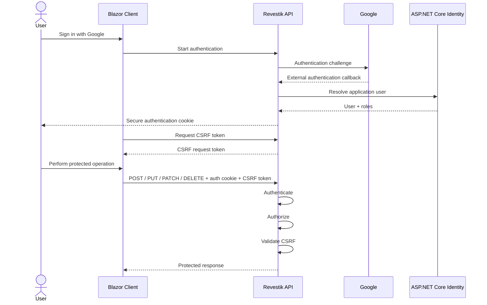

# Security Overview

## 1. Purpose

This document describes the current security model of Revestik.

Security in Revestik is implemented across multiple layers rather than relying on a single mechanism.

The primary security areas currently include:

* Authentication.
* Authorization.
* Cookie security.
* Antiforgery protection.
* Request validation.
* Database integrity.
* CORS configuration.
* Transport security.
* External authentication.
* Server-side trust boundaries.
* Financial-operation authorization and history preservation.

This document describes implemented behavior. Future security requirements should not be represented as existing protections until they are implemented and verified.

## 2. Trust Boundary

Revestik treats the ASP.NET Core server as the primary application trust boundary.

```text
Browser / Blazor WASM
       │
       │ Untrusted input
       ▼
┌─────────────────────────┐
│    ASP.NET Core API     │
│                         │
│ Authentication          │
│ Authorization           │
│ CSRF validation         │
│ Request validation      │
│ Business rules          │
└────────────┬────────────┘
             │
             │ EF Core
             ▼
┌─────────────────────────┐
│       SQL Server        │
│ Constraints / indexes   │
└─────────────────────────┘
```

Code executing in the browser must not be trusted to protect business data or enforce security-sensitive rules.

Client-side validation is primarily a usability mechanism.

## 3. Authentication

Revestik uses ASP.NET Core Identity and cookie-based authentication.

Authentication answers:

> Who is making this request?

Authenticated users receive an authentication cookie that allows the server to associate subsequent requests with their authenticated identity.

The application also contains an external authentication flow using Google.

External authentication does not mean that any Google account automatically receives access to Revestik.

The server remains responsible for determining whether the authenticated external identity corresponds to an authorized application account.

## 4. Protected-by-Default Access

Revestik follows a protected-by-default authorization model.

Server endpoints require authenticated access unless anonymous access is explicitly configured.

```text
Endpoint
   │
   ├── Explicit AllowAnonymous
   │       ↓
   │    Public access
   │
   └── Otherwise
           ↓
      Authentication required
```

Anonymous access should be treated as an explicit security decision.

## 5. Anonymous Endpoints

Only endpoints that require unauthenticated access should be configured with anonymous access.

Current examples include parts of the authentication flow, application health/static hosting requirements, and other explicitly public infrastructure endpoints.

Anonymous endpoints must not expose sensitive business information merely because they are publicly reachable.

## 6. Authorization

Authentication and authorization are separate concerns.

Authentication determines who the user is.

Authorization determines whether that user may perform the operation.

Revestik supports role and policy-based authorization for privileged operations.

Current commercial policies include protected quotation and sale management.

Authorization decisions are enforced by the server.

Hiding a button or page in the Blazor client is not considered authorization because client-side behavior can be bypassed.

## 7. Cookie Security

Authentication cookies are configured as part of the server-side authentication system.

Security-relevant cookie behavior includes protections such as:

* `HttpOnly`.
* `Secure`.
* Appropriate SameSite behavior.

Cookie configuration must be reviewed when deployment topology or authentication flows change.

## 8. Cross-Site Request Forgery Protection

Because Revestik uses cookie-based authentication, authenticated state-changing operations require protection against Cross-Site Request Forgery (CSRF).

Revestik uses ASP.NET Core antiforgery functionality.

The general flow is:



A request with a required missing or invalid antiforgery token must be rejected before the protected business operation executes.

CSRF protection and authentication solve different problems.

A valid authentication cookie identifies the user.

A valid antiforgery token helps demonstrate that a state-changing request originated through the expected application flow.

## 9. CSRF Token Handling

Revestik exposes an authenticated mechanism for obtaining the antiforgery request token.

The antiforgery cookie and request token are intentionally handled differently.

The browser sends the relevant cookie automatically, while the Blazor client obtains the request token and sends it using the configured antiforgery request header.

The shared client-side HTTP handler applies the token to protected mutable API requests.

Antiforgery responses should not be cached as reusable public application data.

## 10. Protected Mutable Commercial Endpoints

Mutable Quotation and Sales operations use antiforgery validation.

Examples include:

* Creating or updating quotations.
* Issuing quotations.
* Creating or updating sales.
* Creating sales from quotations.
* Issuing sales.
* Voiding sales.
* Creating replacement sales.
* Registering payments.
* Voiding payments.

Automated CSRF regression tests protect these boundaries.

## 11. Request Validation

All information received from the client must be treated as untrusted input.

Revestik applies server-side validation to incoming business requests.

Examples include:

* Required values.
* Maximum lengths.
* Identification formats.
* Pagination bounds.
* Commercial quantities and prices.
* Discount consistency.
* Tax-rate constraints.
* Payment amount/reference constraints.
* Required void reasons.

Client-side validation may mirror these rules for usability, but bypassing the client must not bypass authoritative validation.

## 12. Database Integrity

Security and data integrity continue beyond request validation.

Revestik uses EF Core configuration and SQL Server constraints/indexes/sequences to protect important invariants.

Examples include:

* Required database fields.
* Maximum column lengths.
* Unique customer identification.
* Commercial relationships.
* Sequence-backed document numbering.

Expected persistence conflicts should be translated into application behavior rather than exposing database internals.

## 13. SQL Injection

Revestik uses Entity Framework Core for application persistence.

Application queries should continue to use parameterized EF Core mechanisms rather than concatenating untrusted user input into SQL.

Any future raw SQL must use parameterized values and receive additional security review.

## 14. Cross-Origin Resource Sharing

CORS controls which browser origins may make permitted cross-origin requests to the API.

CORS is not an authentication mechanism.

Development requires explicit local origins because Client and API run separately.

Production uses the hosted application model, reducing the need for broad cross-origin access.

## 15. HTTPS

Production Revestik must be served through HTTPS.

Sensitive authentication or business traffic must not intentionally be exposed over plaintext HTTP.

## 16. External Authentication

Revestik supports Google as an external authentication provider.

The external provider verifies external identity, while Revestik still controls application authorization and account status.

A disabled Revestik account must not receive normal application access merely because external authentication succeeded.

## 17. Redirect Safety

Return paths used by authentication flows must be constrained to safe application-local destinations.

External or protocol-relative redirect destinations must not be accepted simply because they were supplied by the client.

## 18. Secrets and Configuration

Credentials and secrets must not be committed to source control.

Examples include:

* Database credentials.
* External authentication secrets.
* API credentials.
* Production administrative credentials.
* Signing or service secrets.

Any future fiscal signing key or certificate must remain server-side and outside Blazor WebAssembly assets.

## 19. Error Handling and Information Exposure

Client-facing errors should provide enough information for correct application behavior without unnecessarily exposing implementation details.

Sensitive details must not be intentionally returned to users, including internal stack traces, credentials, connection data, or secrets.

## 20. Logging

Security-relevant events may require server-side logging.

Logs must avoid recording secrets, cookies, antiforgery tokens, or unnecessary sensitive customer/payment information.

## 21. Financial and Historical Data

Commercial history should not be destroyed merely to correct a business operation.

Current Sales behavior supports this principle through:

* Payment voiding rather than payment deletion.
* Sale voiding rather than destructive deletion.
* Replacement sales linked to the original sale.
* Quotation preservation after conversion to a sale.

This improves traceability but is not presented as a complete enterprise audit-log implementation.

## 22. Static Application Hosting

The production ASP.NET Core host serves the compiled Blazor WebAssembly application.

Blazor static files must never contain secrets because they are downloaded to the user's device.

Unknown `/api/*` routes remain API responses rather than falling through to the SPA entry point.

## 23. Security Testing

Automated tests currently verify important security behavior, including:

* Authentication requirements.
* Authorization policies.
* Missing/invalid CSRF rejection.
* Protected mutable endpoints.
* Account status behavior.
* Security-sensitive hosting behavior.

Sales mutable endpoints are included in current CSRF regression coverage.

## 24. Defense in Depth

```text
HTTPS
  ↓
Authentication
  ↓
Authorization
  ↓
CSRF validation
  ↓
Request validation
  ↓
Business rules
  ↓
EF Core
  ↓
Database constraints / sequences
```

Each layer protects against a different class of problem.

No individual layer should be assumed to make the others unnecessary.

## 25. Security Review Triggers

A security review should be performed when introducing or significantly changing:

* Authentication providers.
* User registration or invitation.
* Roles or permissions.
* Administrative functionality.
* Payment information.
* Electronic invoicing.
* File uploads.
* Public APIs.
* External integrations.
* Raw SQL.
* Production hosting.
* Secret management.
* Personally identifiable information.
* Audit or financial records.

## 26. Known Scope Limitations

This document does not claim that Revestik has completed:

* Formal penetration testing.
* Independent security certification.
* Regulatory compliance certification.
* Full security threat modeling.
* Complete audit logging.
* Enterprise identity governance.

## 27. Security Principle

> Never trust the client to enforce a rule that protects server-side business data.

The frontend may guide the user.

The server authorizes and validates the operation.

The persistence layer protects critical data invariants.

Security-sensitive behavior should remain explicit, testable, and reviewable as Revestik evolves.