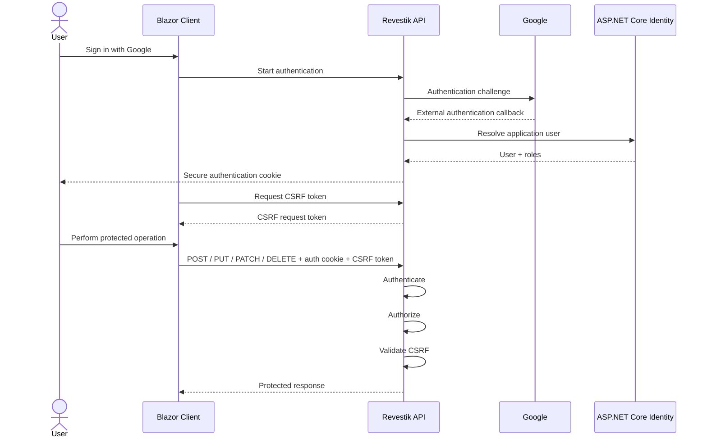

# Security Overview

## 1. Purpose

This document describes the current security model of Revestik.

Security in Revestik is implemented across multiple layers rather than relying on a single mechanism.

The primary security areas currently include:

* Authentication.
* Authorization.
* Cookie security.
* Antiforgery protection.
* Request validation.
* Database integrity.
* Transactional integrity.
* Concurrency protection.
* CORS configuration.
* Transport security.
* External authentication.
* Server-side trust boundaries.
* Commercial and inventory-operation authorization.
* Historical-data preservation.

This document describes implemented behavior. Future security requirements should not be represented as existing protections until they are implemented and verified.

## 2. Trust Boundary

Revestik treats the ASP.NET Core server as the primary application trust boundary.

```text id="vf6doe"
Browser / Blazor WASM
       │
       │ Untrusted input
       ▼
┌─────────────────────────┐
│     ASP.NET Core API    │
│                         │
│ Authentication          │
│ Authorization           │
│ CSRF validation         │
│ Request validation      │
│ Business rules          │
│ Transaction boundaries  │
└────────────┬────────────┘
             │
             │ EF Core
             ▼
┌─────────────────────────┐
│       SQL Server        │
│ Constraints / indexes   │
│ Relationships           │
└─────────────────────────┘
```

Code executing in the browser must not be trusted to protect business data or enforce security-sensitive rules.

Client-side validation is primarily a usability mechanism.

## 3. Authentication

Revestik uses ASP.NET Core Identity and cookie-based authentication.

Authentication answers:

> Who is making this request?

Authenticated users receive an authentication cookie that allows the server to associate subsequent requests with their authenticated identity.

The application also contains an external authentication flow using Google.

External authentication does not mean that any Google account automatically receives access to Revestik.

The server remains responsible for determining whether the authenticated external identity corresponds to an authorized application account.

## 4. Protected-by-Default Access

Revestik follows a protected-by-default authorization model.

Server endpoints require authenticated access unless anonymous access is explicitly configured.

```text id="625t7q"
Endpoint
   │
   ├── Explicit AllowAnonymous
   │       ↓
   │    Public access
   │
   └── Otherwise
           ↓
       Authentication required
```

Anonymous access should be treated as an explicit security decision.

## 5. Anonymous Endpoints

Only endpoints that require unauthenticated access should be configured with anonymous access.

Current examples include parts of the authentication flow, application health/static hosting requirements, and other explicitly public infrastructure endpoints.

Anonymous endpoints must not expose sensitive business information merely because they are publicly reachable.

## 6. Authorization

Authentication and authorization are separate concerns.

Authentication determines who the user is.

Authorization determines whether that user may perform the operation.

Revestik supports role and policy-based authorization for privileged operations.

Current protected capabilities include areas such as:

* Customer management.
* Quotation management.
* Sale management.
* Inventory management.
* Physical inventory counts.
* Inventory cost resolution.
* Administrative operations where applicable.

Authorization decisions are enforced by the server.

Hiding a button or page in the Blazor client is not considered authorization because client-side behavior can be bypassed.

## 7. Cookie Security

Authentication cookies are configured as part of the server-side authentication system.

Security-relevant cookie behavior includes protections such as:

* `HttpOnly`.
* `Secure`.
* Appropriate SameSite behavior.

Cookie configuration must be reviewed when deployment topology or authentication flows change.

## 8. Cross-Site Request Forgery Protection

Because Revestik uses cookie-based authentication, authenticated state-changing operations require protection against Cross-Site Request Forgery (CSRF).

Revestik uses ASP.NET Core antiforgery functionality.

The general flow is:


```mermaid id="48mbfi"
sequenceDiagram
    actor User
    participant Client as Blazor Client
    participant API as Revestik API
    participant Google
    participant Identity as ASP.NET Core Identity

    User->>Client: Sign in with Google
    Client->>API: Start authentication
    API->>Google: Authentication challenge
    Google-->>API: External authentication callback
    API->>Identity: Resolve application user
    Identity-->>API: User + roles
    API-->>User: Secure authentication cookie

    Client->>API: Request CSRF token
    API-->>Client: CSRF request token

    User->>Client: Perform protected operation
    Client->>API: POST / PUT / PATCH / DELETE + auth cookie + CSRF token
    API->>API: Authenticate
    API->>API: Authorize
    API->>API: Validate CSRF
    API-->>Client: Protected response
```

A request with a required missing or invalid antiforgery token must be rejected before the protected business operation executes.

CSRF protection and authentication solve different problems.

A valid authentication cookie identifies the user.

A valid antiforgery token helps demonstrate that a state-changing request originated through the expected application flow.

## 9. CSRF Token Handling

Revestik exposes an authenticated mechanism for obtaining the antiforgery request token.

The antiforgery cookie and request token are intentionally handled differently.

The browser sends the relevant cookie automatically, while the Blazor client obtains the request token and sends it using the configured antiforgery request header.

The shared client-side HTTP handler applies the token to protected mutable API requests.

Antiforgery responses should not be cached as reusable public application data.

## 10. Protected Mutable Endpoints

Mutable authenticated operations use antiforgery validation where applicable.

Current examples include:

### Commercial operations

* Creating or updating quotations.
* Issuing quotations.
* Creating or updating sales.
* Creating sales from quotations.
* Issuing sales.
* Voiding sales.
* Creating replacement sales.
* Registering payments.
* Voiding payments.

### Product and Inventory operations

* Creating or updating products.
* Deactivating products.
* Reactivating products.
* Permanently archiving discontinued products.
* Registering initial inventory.
* Registering inventory adjustments.
* Creating or updating physical inventory counts.
* Applying physical-count adjustments.
* Resolving unknown inventory costs.

Automated CSRF regression tests protect these boundaries where covered.

## 11. Request Validation

All information received from the client must be treated as untrusted input.

Revestik applies server-side validation to incoming business requests.

Examples include:

* Required values.
* Maximum lengths.
* Identification formats.
* Pagination bounds.
* Commercial quantities and prices.
* Discount consistency.
* Tax-rate constraints.
* Payment amount/reference constraints.
* Required void reasons.
* Product and inventory quantities.
* Unit-conversion values.
* Whole-unit requirements.
* Physical-count values.
* Inventory adjustment values.
* Unknown-cost resolution values.

Client-side validation may mirror these rules for usability, but bypassing the client must not bypass authoritative validation.

## 12. Database Integrity

Security and data integrity continue beyond request validation.

Revestik uses EF Core configuration and SQL Server constraints, indexes, relationships, sequences, and concurrency mechanisms to protect important invariants.

Examples include:

* Required database fields.
* Maximum column lengths.
* Unique customer identification.
* Commercial relationships.
* Sequence-backed document numbering.
* Product relationships.
* Inventory movement relationships.
* FIFO cost-layer relationships.
* Physical-count relationships.
* Filtered indexes.
* Unique reversal relationships.
* Product lifecycle state.
* Concurrency-sensitive updates.

Expected persistence conflicts should be translated into application behavior rather than exposing database internals.

## 13. Transactional Integrity

Some business operations require several persistence changes to remain consistent.

These operations must not leave partially applied state.

Examples include:

* Issuing a sale that consumes inventory.
* Updating FIFO cost layers together with inventory movements.
* Voiding a sale and restoring its exact inventory consumption.
* Applying physical-count adjustments.
* Coordinating current stock and historical movement records.

Where required, Revestik uses transaction boundaries so the critical operation succeeds or fails as a unit.

Transactional integrity is treated as part of protecting business data from corruption.

## 14. Inventory Integrity

Inventory introduces security and integrity requirements beyond ordinary CRUD validation.

Important protections include:

* Preventing tracked stock from becoming negative.
* Enforcing valid inventory quantities.
* Enforcing whole-unit rules where configured.
* Preserving immutable inventory movement history.
* Preserving historical FIFO cost information.
* Preventing duplicate reversal of the same Sale inventory movement.
* Restoring the exact inventory provenance consumed by a voided Sale.
* Preserving physical-count traceability.
* Preserving product historical references after archival.

The client must not be trusted to calculate or enforce these guarantees.

Authoritative inventory behavior remains server-side.

## 15. Concurrency Protection

Concurrent requests must not silently violate critical business invariants.

Current areas where concurrency matters include:

* Commercial sequence generation.
* Product updates.
* Inventory-related critical transitions.
* Database uniqueness and relationship rules.

Where optimistic concurrency is used, a stale update should result in controlled application behavior rather than overwriting a newer valid state without detection.

Concurrency protection complements authorization and validation; it addresses a different class of integrity risk.

## 16. SQL Injection

Revestik uses Entity Framework Core for application persistence.

Application queries should continue to use parameterized EF Core mechanisms rather than concatenating untrusted user input into SQL.

Any future raw SQL must use parameterized values and receive additional security review.

Using EF Core does not make arbitrary raw SQL automatically safe.

## 17. Cross-Origin Resource Sharing

CORS controls which browser origins may make permitted cross-origin requests to the API.

CORS is not an authentication mechanism.

Development requires explicit local origins because Client and API run separately.

Production uses the hosted application model, reducing the need for broad cross-origin access.

## 18. HTTPS

Production Revestik must be served through HTTPS.

Sensitive authentication or business traffic must not intentionally be exposed over plaintext HTTP.

HTTPS protects transport but does not replace authentication, authorization, antiforgery protection, or request validation.

## 19. External Authentication

Revestik supports Google as an external authentication provider.

The external provider verifies external identity, while Revestik still controls application authorization and account status.

A disabled Revestik account must not receive normal application access merely because external authentication succeeded.

## 20. Redirect Safety

Return paths used by authentication flows must be constrained to safe application-local destinations.

External or protocol-relative redirect destinations must not be accepted simply because they were supplied by the client.

## 21. Secrets and Configuration

Credentials and secrets must not be committed to source control.

Examples include:

* Database credentials.
* External authentication secrets.
* API credentials.
* Production administrative credentials.
* Signing or service secrets.

Any future fiscal signing key or certificate must remain server-side and outside Blazor WebAssembly assets.

Future email credentials used for purchase-document ingestion must also remain server-side and must not be exposed through client assets or source control.

## 22. Error Handling and Information Exposure

Client-facing errors should provide enough information for correct application behavior without unnecessarily exposing implementation details.

Sensitive details must not be intentionally returned to users, including:

* Internal stack traces.
* Database connection information.
* Credentials.
* Authentication cookies.
* Antiforgery tokens.
* Internal secret values.
* Unnecessary infrastructure details.

Expected business conflicts should use controlled application responses rather than exposing raw persistence exceptions.

## 23. Logging

Security-relevant events may require server-side logging.

Logs must avoid recording secrets, cookies, antiforgery tokens, or unnecessary sensitive customer/payment information.

Future purchase-document/email integrations must also avoid logging credentials or entire sensitive payloads unless there is an explicit and reviewed operational requirement.

Logging should support diagnosis without becoming an unnecessary copy of sensitive business data.

## 24. Financial, Inventory, and Historical Data

Important operational history should not be destroyed merely to correct a business operation.

Current Sales behavior supports this principle through:

* Payment voiding rather than payment deletion.
* Sale voiding rather than destructive deletion.
* Replacement sales linked to the original sale.
* Quotation preservation after conversion to a Sale.

Current Inventory behavior extends the same principle through:

* Immutable inventory movement history.
* FIFO cost-layer history.
* Reversal movements linked to original Sale movements.
* Exact restoration of original consumed layers.
* Physical-count records and adjustment traceability.
* Unknown-cost resolution without overwriting the original historical cost source.
* Logical product archival instead of physical deletion.

This improves traceability but is not presented as a complete enterprise audit-log implementation.

## 25. Product Archival

A product that is permanently removed from normal product workflows is archived logically rather than physically deleted.

Current lifecycle semantics include:

```text id="crz8ut"
Active
IsDeleted = false
IsArchived = false

Discontinued
IsDeleted = true
IsArchived = false

Archived
IsDeleted = true
IsArchived = true
```

This design prevents user-facing product management from destroying historical references.

Archived products remain persisted while being excluded from normal product workflows.

Historical Sales, Quotations, Inventory movements, cost layers, and physical counts are therefore not required to lose their product relationship merely because the product is no longer operational.

## 26. Static Application Hosting

The production ASP.NET Core host serves the compiled Blazor WebAssembly application.

Blazor static files must never contain secrets because they are downloaded to the user's device.

Unknown `/api/*` routes remain API responses rather than falling through to the SPA entry point.

## 27. Security Testing

Automated tests currently verify important security and integrity behavior, including:

* Authentication requirements.
* Authorization policies.
* Missing/invalid CSRF rejection.
* Protected mutable endpoints.
* Account status behavior.
* Security-sensitive hosting behavior.
* Sales mutable operations.
* Inventory mutable operations where covered.
* SQL Server persistence constraints.
* Concurrency-sensitive behavior.
* Inventory reversal data integrity.
* Product lifecycle behavior.
* Physical-count behavior.
* Inventory cost-resolution behavior.

Security tests verify observable application protections rather than assuming the UI prevents misuse.

## 28. Defense in Depth

```text id="5rqy3x"
HTTPS
  ↓
Authentication
  ↓
Authorization
  ↓
CSRF validation
  ↓
Request validation
  ↓
Business rules
  ↓
Transactional integrity
  ↓
EF Core
  ↓
Database constraints / indexes / relationships
```

Each layer protects against a different class of problem.

No individual layer should be assumed to make the others unnecessary.

## 29. External Integration Boundary

External systems must remain behind server-side trust boundaries.

Current external authentication and taxpayer/location integrations follow this model.

Future purchase-related integrations should follow the same principle.

In particular:

* The Blazor client should not directly read business email credentials.
* Inventory should not directly ingest business email.
* Inventory should not parse Costa Rican XML 4.4 documents.
* Purchase-document processing should validate and classify external documents before they create operational effects.
* Accepted purchase behavior should invoke explicit inventory operations rather than bypassing Inventory rules.

This boundary limits the amount of external untrusted data that can directly influence inventory state.

## 30. Security Review Triggers

A security review should be performed when introducing or significantly changing:

* Authentication providers.
* User registration or invitation.
* Roles or permissions.
* Administrative functionality.
* Payment information.
* Electronic invoicing.
* Business email integration.
* XML/document ingestion.
* File uploads.
* Public APIs.
* External integrations.
* Raw SQL.
* Production hosting.
* Secret management.
* Personally identifiable information.
* Audit or financial records.
* Inventory mutation workflows.
* Purchase-to-inventory integration.

## 31. Known Scope Limitations

This document does not claim that Revestik has completed:

* Formal penetration testing.
* Independent security certification.
* Regulatory compliance certification.
* Full security threat modeling.
* Complete audit logging.
* Enterprise identity governance.
* Formal production incident-response procedures.
* Comprehensive browser/E2E security testing.

These limitations do not remove the need to preserve the protections already implemented.

## 32. Security Principle

> Never trust the client to enforce a rule that protects server-side business data.

The frontend may guide the user.

The server authenticates, authorizes, validates, and executes the business operation.

The persistence layer protects critical relational and historical invariants.

Security-sensitive and integrity-sensitive behavior should remain explicit, testable, and reviewable as Revestik evolves.